# 基础VHDL教程(BASIC VHDL TUTORIALS)

------

基础VHDL系列教程涵盖了VHDL最重要特性。这门面向初学者的VHDL课程将帮助你学习该语言的基本原理，是你将来成为VHDL大师的入门课程。

如果你尚不了解VHDL，可以从这里开始: [什么是VHDL？(What is VHDL?)](https://vhdlwhiz.com/what-is-vhdl/)

## 如何开始学习本教程 (HOW TO GET STARTED)

学习本教程没有任何硬件要求，也就是说你可以立马开始学习 。本VHDL教程中的练习仅在VHDL仿真器(simulator)中运行测试。在本系列教程中使用的是ModelSim VHDL模拟器，当然读者也可以用任何能使用的VHDL仿真器。

**你迈出的第一步即安装一个VHDL仿真器。**

**[点击此处选择免费的ModelSim (Click here and choose one of the free ModelSim options!)](https://vhdlwhiz.com/free-vhdl-simulator-alternatives/)**

ModelSim是最常见的VHDL仿真器，也是你在第一份工作中最有可能遇到的仿真器，学习ModelSim对于熟悉行业中关于仿真器的标准是很有优势的。你可以把这一点写在简历上，使求职更有针对性。

## 课程材料(COURSE MATERIAL)

点击下面的横幅，下载课程材料。你将得到一个zip压缩文件，其中包含一个含所有练习的子文件夹，以及一个含所有答案的子文件夹。我建议你使用练习子文件夹中的.vhd文件作为每个教程的起点，这将使你不必重复相同的代码。

打开练习子文件夹中每个教程对应的.vhd文件，你只需要用代码替换TODO注释来完成每个练习，而你只允许在遇到困难时参考答案子文件夹中的.vhd文件。

## 练习(EXERCISES)

每个教程都涵盖一个基本概念。从点击第一个横幅开始，让你的开发环境启动运行，并在你自己电脑上尝试所有练习。

请从1号练习开始，一直到最后的23号练习结束。在每一节之后，你可以参加VHDL测验，以测试你所习得的技能。

你可以在我们私密的**[脸书群组(Facebook group)](https://www.facebook.com/groups/vhdlwhiz/)**提问或讨论本教程。

**点击下图开始学习!**

## 第一章(PART 1)

在VHDL系列教程的第一章，你将熟悉行业内所使用的工具。如果你还并不熟悉这些工具，你将从安装VHDL仿真器和代码编辑器开始。

你将在第一章教程中编写并运行你的第一个VHDL程序，并学习VHDL语言的核心功能，如向控制台打印文本，以及三种不同的循环语句。

由于VHDL是一种为创建数字逻辑而设计的并行编程语言，我们将探讨VHDL的一些特殊之处。你也将学习如何操作数字逻辑工程师所拥有的最重要工具——VHDL仿真器。

1. 如何免费安装VHDL 仿真器和编辑器
2. 如何创建你的第一个VHDL程序：HELLO WORLD!
3. 如何在VHDL中实现延迟：WAIT FOR
4. 如何在VHDL中使用LOOP和EXIT
5. 如何在VHDL中使用FOR循环
6. 如何在VHDL中使用WHILE循环

## 第二章(PART 2)

现在你已经逐渐熟悉VHDL，是时候深入了解一些硬件描述语言的特有概念了。

你将学习在VHDL中由一个线式信号(wire)表示一个比特。你还将看到虽然VHDL与其他编程语言一样有变量(variable)，但实际上信号(signal)是数字设计中首选的存储单元。

在本章之后，您将了解信号和变量之间的区别，以及使用信号和敏感列表(sensitivity list)进行进程间通信(inter-process communication)。

1. VHDL中信号(SIGNAL)和变量(VARIABLE)的区别
2. 如何在VHDL 中使用WAIT ON和WAIT UNTIL
3. 如何在VHDL 中使用条件语句IF-THEN-ELSIF-ELSE
4. 如何在VHDL中创建包含敏感列表的进程
5. 如何使用VHDL 中最常见的类型：STD_LOGIC
6. 如何在VHDL中创建信号矢量：STD_LOGIC_VECTOR

## 第三章(PART 3)

在第三章中，您将学习如何在 VHDL 中表示整数，也将看到我们如何利用 VHDL 中位级别的细粒度控制来帮助你实现设计。同时，我们将探索在位级别处理数字时的一些陷阱。

您将学习如何在 VHDL 中创建模块 (module)，了解数字设计中的基本构建块(building blocks)、多路转接器(multiplexer)和触发器(flip-flop)。

在本章中，您将了解 VHDL 中并行进程(concurrent process)和时钟进程(clocked process)之间的区别。

1. 如何在VHDL中使用有符号数据(SIGNED)和无符号数据(UNSIGNED)
2. 如何在VHDL中创建并行语句(CONCURRENT STATEMENT)
3. 如何在VHDL 中使用CASE-WHEN语句
4. 如何在VHDL中使用端口映射(PORT MAP)实例化
5. 如何在VHDL中使用常量(CONSTANT)和类属(GENERIC)
6. 如何在VHDL中创建时钟进程(CLOCKED PROCESS)

## 第四章(PART 4)

在VHDL课程的最后一章，我们将首先在VHDL中创建一个功能完备的计时模块。你将学习VHDL中模拟时间(simulation time)和实际时间(real-time)之间的区别。

你将利用在本教程中所学知识来解决一个现实生活中的问题。我们将创建一个用于管理道路交叉口的交通灯控制系统。在此过程中，你将学习到数字设计中最重要的概念之一，即有限状态机(the finite-state machine)。

最后，你将学会把重复的代码分解成函数(functions)和过程(procedures)等子程序。分而治之(divide and conquer)是作为一个VHDL工程师行走江湖的唯一可行策略。

1. 如何在VHDL中创建计时器(HOW TO CREATE A TIMER IN VHDL)
2. 如何在VHDL中使用过程(HOW TO USE A PROCEDURE IN VHDL)
3. 如何在VHDL中创建有限状态机(HOW TO CREATE A FINITE-STATE MACHINE IN VHDL)
4. 如何在VHDL中使用函数(HOW TO USE A FUNCTION IN VHDL)
5. 如何在VHDL中使用impure函数(HOW TO USE AN IMPURE FUNCTION IN VHDL)
6. 如何在VHDL的进程中使用过程(HOW TO USE A PROCEDURE IN A PROCESS IN VHDL)

## 下一步学习 (WHERE TO GO FROM HERE)

首先，祝贺你已完成基础VHDL教程，干得好!

有了你新习得的VHDL技能，是时候更进一步学习了。如果你对VHDL和FPGA学习足够认真，你应该获得一块开发板。FPGA开发板的价格可以低至25美元。我经常使用并推荐的开发板是[Lattice iCEstick](https://www.latticesemi.com/icestick).

我在进阶的[Dot Matrix](https://academy.vhdlwhiz.com/dotmatrix?utm_source=vw&utm_medium=page&utm_campaign=dot matrix 2021-07 post-launch&utm_content=%2Fbasic-vhdl-tutorials%2F)FPGA课程和 [Fast-Track](https://academy.vhdlwhiz.com/fast-track?utm_source=vw&utm_medium=page&utm_campaign=fast-track 2021-01&utm_content=%2Fbasic-vhdl-tutorials%2F) 快速入门VHDL课程中使用的都是Lattice iCEstick。在下面阅读更多关于Fast-Track VHDL和FPGA课程的信息!

# [如何免费安装VHDL模拟器和编辑器(HOW TO INSTALL A VHDL SIMULATOR AND EDITOR FOR FREE)](https://vhdlwhiz.com/free_vhdl_simulator_and_editor/)

尽管VHDL和FPGA工具通常非常昂贵，但如果你是一个学生，你能很容易地免费获得最先进的软件——众多用于处理VHDL的仿真器、编辑器和集成开发环境(IDE)。本文将告诉你如何安装VHDL工程师所使用的两个最常用的程序。

## VHDL仿真器(VHDL SIMULATOR)

Siemens EDA (原Mentor Graphics) 的ModelSim 是最常见的VHDL仿真器。在你的第一份VHDL工作中，你有可能必须使用ModelSim或QuestaSim类的程序。请在设计实践中尽可能使你的代码具有良好的可移植性，本博客中的代码也不例外。如果你正使用其他的VHDL仿真器，就继续使用吧，仿真器的工作原理类似。
VHDL 仿真器的许可证(licenses)非常昂贵，但幸运的是ModelSim VHDL 仿真器有若干免费合法的版本。
**
[点击此处查看Windows、Linux或Mac上的免费VHDL模拟器安装选项列表 (Click here for a list of free VHDL simulator installation options for Windows, Linux, or Mac)](https://vhdlwhiz.com/free-vhdl-simulator-alternatives/)**

## VHDL编辑器(VHDL EDITOR)

你可以直接在ModelSim的内置编辑器中编写代码，但最好使用一个外部编辑器。我将在系列教程中使用 [Notepad++](https://notepad-plus-plus.org/) ，它是Windows平台上一个很好的、免费的编辑器，它还有用于VHDL语法高亮的插件。

一个关于如何下载和安装编辑器和VHDL插件的录屏教程如下：

<https://youtu.be/wvVO6NSI58E>

当你顺利安装ModelSim和Notepad++后，你就完成了开始学习VHDL所需的一切准备工作。

[点击此处获取基础VHDL教程 (Take the basic VHDL tutorials here >>)](https://vhdlwhiz.com/basic-vhdl-tutorials/)

也许你在想：“那硬件呢？我不需要一个FPGA开发板或其他东西吗？”。最终，你会想在真正的硬件上尝试你的代码，但对于学习VHDL的这一唯一目的，你只需要一个仿真器。

# [如何创建你的第一个VHDL程序：HELLO WORLD! (HOW TO CREATE YOUR FIRST VHDL PROGRAM: HELLO WORLD!)](https://vhdlwhiz.com/hello-world/)

在学习一种新的编程语言时，我总是喜欢从学习如何打印(print)开始。当你成功输出“Hello World!”时，你知道自己已经具备了该语言的运行环境。它还向你展示了语言的基本骨架，即产生任何输出所需的最少的代码。

你可能会想：VHDL是一种硬件描述语言，它怎么可能输出任何文本呢？在实践中你需要一个屏幕连接到FPGA或其他东西上，中间还有各种逻辑，而这些并不简单。虽然上面所言都是真的，但让我们暂时忘记FPGA和ASIC，把注意力集中在VHDL语言上。

**本篇博文是[基础VHDL教程(Basic VHDL Tutorials)](https://vhdlwhiz.com/basic-vhdl-tutorials/) 的一部分。**

VHDL可以被认为是一种并行的编程语言，因此我们可以用这种程序员思维来学习它。由于我们使用该语言来描述数字电路，在计算机上运行它的唯一方法是使用*仿真器(simulator)*，而仿真器绝对能够在屏幕上输出“Hello World!”。

**[如何免费安装VHDL模拟器和编辑器(How to install a VHDL simulator and editor for free)](https://vhdlwhiz.com/free_vhdl_simulator_and_editor/)**

## 练习

本视频教程将告诉你如何创建第一个VHDL程序：

<https://youtu.be/h4ZXge1BE80>

我们创建的代码最终如下所示：

```vhdl
entity T01_HelloWorldTb is
end entity;
 
architecture sim of T01_HelloWorldTb is
begin
 
    process is
    begin
 
        report "Hello World!";
        wait;
 
    end process;
 
end architecture;
```

当我们在ModelSim中按下运行(run)按钮时，仿真器控制台(console)的输出：

```tcl
VSIM 2> run
# ** Note: Hello World!
#    Time: 0 ns  Iteration: 0  Instance: /t01_helloworld
```

## 解析

我们在前两行声明了*实体(entity)*。模块的实体声明了输入和输出。要想在仿真器中运行一个模块，模块就不能有任何输入或输出。因此，我们的模块除了一个空的实体声明外，没有其他东西。

接下来，我们声明了模块的*架构(architecture)*。实体是模块与外部世界的接口，而架构是其内部的实现。一个模块可能有几个架构，共用同一个实体。我不会太聚焦于这一特征，因为这是VHDL的高级功能。

我们在架构中声明了一个*进程(process)*。我们现在可以把进程看成是程序中的一个线程，所有事件是顺序发生的。

在本进程中，我们使用`report`关键字打印“Hello World!”。在下一行中，有一个单独的 `wait;`，当仿真器解析到这一行时，就不会再发生什么了，进程将在这里永远等待。

当我们在ModelSim中模拟该设计时，我们可以看到“Hello World!”被打印到控制台输出，之后也不会再显示其他内容。

## 要点

- 可以把进程(process)看作是程序线程(program thread)
- `report`语句将文本打印到仿真器控制台
- 进程的执行将在 `wait;`语句中永远等待

# [如何在VHDL中延迟时间：WAIT FOR(HOW TO DELAY TIME IN VHDL: WAIT FOR)](https://vhdlwhiz.com/wait-for/)

在 [前面教程(the previous tutorial)](https://vhdlwhiz.com/hello-world/) 中，我们了解到进程可以被认为是程序线程。我们还了解到，一个`wait;`语句会使程序无限期地暂停。但是有没有一种方法可以让程序等待任何指定时间值，而不是永远暂停？

如果我们把`wait;` 完全去掉，并试图编译该程序，编译器会陷入一个无限循环。编译器所指的循环是*进程循环(process loop)*，VHDL中的进程（线程）永远不会终止，它将在`begin`和`end process;` 语句之间不断循环，故在进程循环的某个地方必须有一个`wait`语句。

**本篇博文是[基础VHDL教程(Basic VHDL Tutorials)](https://vhdlwhiz.com/basic-vhdl-tutorials/) 的一部分。**

`wait;`会导致程序永远暂停，而`wait for`语句可以用来使程序延迟任意指定时间。

`wait for` 语句的语法如下所示：

`wait for <time_value> <time_unit>;`

其中`<time_value>` 是数字， `<time_unit>` 是下列时间单位之一：

| **fs**  | 飞秒 |
|---------|------|
| **ps**  | 皮秒 |
| **ns**  | 纳秒 |
| **us**  | 微秒 |
| **ms**  | 毫秒 |
| **sec** | 秒   |
| **min** | 分钟 |
| **hr**  | 小时 |

## 练习

本视频教程将告诉你如何使用`wait for` 语句在给定的时间内暂停进程：

<https://youtu.be/EoiqKxaJs18>

我们在本教程中创建的代码如下所示：

```vhdl
entity T02_WaitForTb is
end entity;
 
architecture sim of T02_WaitForTb is
begin
 
    process is
    begin
        -- This is the start of the process "thread"
  
        report "Peekaboo!";
         
        wait for 10 ns;
         
        -- The process will loop back to the start from here
    end process;
 
end architecture;
```

当我们在ModelSim中按下运行(run)按钮时，仿真器控制台(console)的输出：

```tcl
VSIM 2> run
# ** Note: Peekaboo!
#    Time: 0 ns  Iteration: 0  Instance: /t02_waitfortb
# ** Note: Peekaboo!
#    Time: 10 ns  Iteration: 0  Instance: /t02_waitfortb
# ** Note: Peekaboo!
#    Time: 20 ns  Iteration: 0  Instance: /t02_waitfortb
...
```

## 解析

在本例中，我们使用 `10 ns`，即10纳秒。当使用MHz时钟频率运行的数字逻辑时，通常会使用纳秒级的增量表示时间。

当在仿真器中运行代码时，它每隔10ns就向控制台打印“Peekaboo!”。因为在仿真器中，`report` 语句所花费的时间为零，循环也是如此。

## 要点

- 要点 `wait for`处暂停指定时间
- 除 `wait`语句外的所有语句(statements) 花费的模拟时间为零

# [如何在VHDL中使用循环和退出(HOW TO USE LOOP AND EXIT IN VHDL)](https://vhdlwhiz.com/loop-and-exit/)

在 [之前教程(previous tutorial)](https://vhdlwhiz.com/wait-for/) 中，我们学习了如何使用 `wait for`语句来延迟时间。我们还了解了进程循环(process loop)。我们知道，如果不加干涉，进程（线程）将永远在进程中循环。

但如果我们想在进程的开始只实现一次某些功能呢？然后在结尾处再循环一些其他的代码？VHDL中最简单的循环可以通过使用`loop`语句来创建。

**本篇博文是[基础VHDL教程(Basic VHDL Tutorials)](https://vhdlwhiz.com/basic-vhdl-tutorials/) 的一部分。**

简单循环的语法如下所示：

```vhdl
loop
end loop;
```

如上图所示的循环将无限地继续运行下去，或者直到遇到 `exit;`。 `exit`语句可用于跳出任何循环。

## 练习

本视频教程将告诉你如何创建简单的循环并跳出循环：

<https://youtu.be/V5pyKIud_Sg>

我们在本教程中创建的代码最终如下所示：

```vhdl
entity T03_LoopTb is
end entity;
 
architecture sim of T03_LoopTb is
begin
 
    process is
    begin
  
        report "Hello!";
         
        loop
            report "Peekaboo!";
            exit;
        end loop;
         
        report "Goodbye!";
        wait;
         
    end process;
 
end architecture;
```

当我们在ModelSim中按下运行(run)按钮时，仿真器控制台(console)的输出：

```tcl
VSIM 2> run
# ** Note: Hello!
#    Time: 0 ns  Iteration: 0  Instance: /t03_looptb
# ** Note: Peekaboo!
#    Time: 0 ns  Iteration: 0  Instance: /t03_looptb
# ** Note: Goodbye!
#    Time: 0 ns  Iteration: 0  Instance: /t03_looptb
```

## 解析

当在仿真器中运行最终代码时，我们可以看到第一个“Hello!”被打印到ModelSim控制台。然后，在`loop;`和`end loop;`之间的“Peekaboo!”被打印出来。在下一行，程序触发`exit;`语句，使程序跳出循环。最后，“Goodbye!”被打印出来。在这之后无事发生，因为程序永远停在`wait;` 语句上。

我们可以从打印出来的时间戳中看到，一切都发生在模拟时间0ns。正如我们在 [之前教程(previous tutorial)](https://vhdlwhiz.com/wait-for/)中所学到的，除了 `wait`语句之外，其他语句都不会消耗时间。

## 要点

- `loop` 语句实现无限循环
- `exit` 语句跳出*任何*循环

# [如何在VHDL中使用FOR循环(HOW TO USE A FOR-LOOP IN VHDL)](https://vhdlwhiz.com/for-loop/)

在[上一教程(previous tutorial)](https://vhdlwhiz.com/loop-and-exit/) 中，我们学习了如何通过使用 `loop`语句来创建无限循环，以及如何通过使用 `exit`语句跳出循环。但是，如果我们想让循环迭代一定的有限次数呢？For循环就是实现这一目标的最简单方法。

For循环允许你在固定整数或枚举范围内进行迭代。属于当前迭代的整数值或枚举项将通过一个隐式声明的常数在循环中可用。

**本篇博文是[基础VHDL教程(Basic VHDL Tutorials)](https://vhdlwhiz.com/basic-vhdl-tutorials/) 的一部分。**

For循环的语法是：

```vhdl
for <c> in <r> loop
end loop;
```

`<c>` 是表征常数的任意名称，其可在循环中使用。`<r>` 是一个整数值或枚举项的范围，循环将对此进行迭代。整数值范围可以递增或递减。

包括从0到9的所有10个数字递增的VHDL代码：

```vhdl
0 to 9
```

包括从9到0的所有10个数字递减的VHDL代码：

```vhdl
9 downto 0
```

只包括数字0的VHDL代码：

```vhdl
0 to 0
```

完全不包含任何数字的空范围VHDL代码：

```vhdl
0 to -1
```

## 练习

<https://youtu.be/OjIHfYkQUYA>

我们在本教程中创建的代码最终如下所示：

```vhdl
entity T04_ForLoopTb is
end entity;
 
architecture sim of T04_ForLoopTb is
begin
 
    process is
    begin
 
        for i in 1 to 10 loop
            report "i=" & integer'image(i);
        end loop;
        wait;
         
    end process;
 
end architecture;
```

当我们在ModelSim中按下运行(run)按钮时，仿真器控制台(console)的输出：

```tcl
VSIM 2> run
# ** Note: i=1
#    Time: 0 ns  Iteration: 0  Instance: /t04_forlooptb
# ** Note: i=2
#    Time: 0 ns  Iteration: 0  Instance: /t04_forlooptb
# ** Note: i=3
#    Time: 0 ns  Iteration: 0  Instance: /t04_forlooptb
# ** Note: i=4
#    Time: 0 ns  Iteration: 0  Instance: /t04_forlooptb
# ** Note: i=5
#    Time: 0 ns  Iteration: 0  Instance: /t04_forlooptb
# ** Note: i=6
#    Time: 0 ns  Iteration: 0  Instance: /t04_forlooptb
# ** Note: i=7
#    Time: 0 ns  Iteration: 0  Instance: /t04_forlooptb
# ** Note: i=8
#    Time: 0 ns  Iteration: 0  Instance: /t04_forlooptb
# ** Note: i=9
#    Time: 0 ns  Iteration: 0  Instance: /t04_forlooptb
# ** Note: i=10
#    Time: 0 ns  Iteration: 0  Instance: /t04_forlooptb
```

## 解析

意料之中，我们的For循环迭代了10次才终止。在仿真时间0时， `i` 值被打印到仿真器控制台10次。循环内部没有wait语句，因此循环完成的时间为0。最后，程序在`wait;`上进入无限期暂停。

我们学习了如何通过使用`integer'image()`将整数转换成字符串，并使用`&`字符将两个字符串连接在一起。

## 要点

- For循环可以在递增或递减的整数范围内进行迭代
- 递增范围用`to`表示，递减范围用`downto`表示
- 整数可以通过使用`integer'image()`转换为字符串
- 两个字符串可以通过使用字符串连接符`&`连接

# [如何在VHDL中使用WHILE循环(HOW TO USE A WHILE-LOOP IN VHDL)](https://vhdlwhiz.com/while-loop/)

在[上一教程(previous tutorial)](https://vhdlwhiz.com/for-loop/)中，我们学习了如何使用For循环来迭代某个范围。但如果我们想对循环进行更详细的控制，而不仅仅是某个固定范围呢？我们可以使用While循环来实现。
只要所测试表达式评估为`true`，While循环将继续迭代所包含的代码。因此，While循环适用于事先不知道到底需要迭代多少次的情况。

**本篇博文是[基础VHDL教程(Basic VHDL Tutorials)](https://vhdlwhiz.com/basic-vhdl-tutorials/) 的一部分。**

While循环的语法如下所示：

```vhdl
while <condition> loop
end loop;
```

 `<condition>` 是一个布尔值的`true`或`false`，也可以是一个取值为`true`或`false`的表达式。该条件在循环的每次迭代前被评估，只有为`true`时，循环才会继续。

如果`i`小于10，则为`真(true)`的示例表达式：

```vhdl
i < 10
```

如果`i`不为10，则为`真(true)`的示例表达式：

```vhdl
i /= 10
```

如果`i` 大于或等于0，且小于2^8=256，则表达式示例为`true`:

```vhdl
i >= 0 and i < 2**8;
```

关系运算符：

| **=**  | 等于     |
|--------|----------|
| **/=** | 不等于   |
| **<**  | 小于     |
| **<=** | 小于等于 |
| **>**  | 大于     |
| **>=** | 大于等于 |

逻辑运算符：

| **not** *a*      | 如果*a*为假，则为真                                  |
|------------------|------------------------------------------------------|
| *a* **and** *b*  | 如果*a*和*b*都为真，则为真                           |
| *a* **or** *b*   | 如果*a*或*b*为真，则为真                             |
| *a* **nand** *b* | 如果*a*或*b*为假，则为真                             |
| *a* **nor** *b*  | 如果*a*和*b*都为假，则为真                           |
| *a* **xor** *b*  | 如果*a*和*b*中有且仅有一个为真，则为真               |
| *a* **xnor** *b* | 如果*a*和*b*同为真或同为假（即*a*和*b*相等），则为真 |

## 练习

本视频教程将告诉你如何使用variable来控制While循环：

<https://youtu.be/9mTruWYCDxA>

我们在本教程中创建的代码最终如下所示：

```vhdl
entity T05_WhileLoopTb is
end entity;
 
architecture sim of T05_WhileLoopTb is
begin
 
    process is
        variable i : integer := 0;
    begin
 
        while i < 10 loop
            report "i=" & integer'image(i);
            i := i + 2;
        end loop;
        wait;
 
    end process;
 
end architecture;
```

当我们在ModelSim中按下运行(run)按钮时，仿真器控制台(console)的输出：

```tcl
VSIM 2> run
# ** Note: i=0
#    Time: 0 ns  Iteration: 0  Instance: /t05_whilelooptb
# ** Note: i=2
#    Time: 0 ns  Iteration: 0  Instance: /t05_whilelooptb
# ** Note: i=4
#    Time: 0 ns  Iteration: 0  Instance: /t05_whilelooptb
# ** Note: i=6
#    Time: 0 ns  Iteration: 0  Instance: /t05_whilelooptb
# ** Note: i=8
#    Time: 0 ns  Iteration: 0  Instance: /t05_whilelooptb
```

## 解析

我们创建整数变量`i` ，并初始化为0。在While循环中使用表达式——只要`i` 小于10就为true。因为在每次迭代中都将`i` 递增2，所以最后打印出来的数字是8。

在下一次迭代中，因为10并不小于10，`i < 10`被评估为`false`。循环结束后，程序进入了`wait;`被无限地暂停。

## 要点

- 只要条件为`真(true)`，While循环就会继续。
- 循环条件在While的每次迭代前都被评估。
- 变量(variable)可以在进程 (process)中声明和使用

[参加VHDL基础测试--第一章(Take the Basic VHDL Quiz – part 1 »)](https://vhdlwhiz.com/basic-vhdl-quiz-part-1/)

# [VHDL中信号与变量有何不同(HOW A SIGNAL IS DIFFERENT FROM A VARIABLE IN VHDL)](https://vhdlwhiz.com/signals-vs-variables/)

在[上一教程(previous tutorial)](https://vhdlwhiz.com/while-loop/)
中，我们学习了如何在进程中声明变量。变量有利于在进程中创建算法，但它们不能被外部访问。如果一个变量的范围只在某进程内，那么它如何与其他逻辑进行交互？解决这个问题的办法是*信号(signal)*。

信号是在VHDL文件中`architecture <architecture_name> of <entity_name> is`和`begin`语句之间声明的，也被称为架构的声明部分。

**本篇博文是[基础VHDL教程(Basic VHDL Tutorials)](https://vhdlwhiz.com/basic-vhdl-tutorials/) 的一部分。**

声明信号(signal)的语法如下所示：

`signal <name> : <type>;`

信号可以通过赋予初始值而有选择地声明：

`signal <name> : <type> := <initial_value>;`

## 练习

本视频教程将告诉你如何声明信号，我们也将学到变量和信号之间的主要区别。

<https://youtu.be/WDwHRoX6uB0>

我们在本教程中创建的代码最终如下所示：

```vhdl
entity T06_SignalTb is
end entity;
 
architecture sim of T06_SignalTb is
 
    signal MySignal : integer := 0;
 
begin
 
    process is
        variable MyVariable : integer := 0;
    begin
 
        report "*** Process begin ***";
 
        MyVariable := MyVariable + 1;
        MySignal   <= MySignal + 1;
 
        report "MyVariable=" & integer'image(MyVariable) &
            ", MySignal=" & integer'image(MySignal);
 
        MyVariable := MyVariable + 1;
        MySignal   <= MySignal + 1;
 
        report "MyVariable=" & integer'image(MyVariable) &
            ", MySignal=" & integer'image(MySignal);
 
        wait for 10 ns;
 
        report "MyVariable=" & integer'image(MyVariable) &
            ", MySignal=" & integer'image(MySignal);
 
    end process;
 
end architecture;
```

当我们在ModelSim中按下运行(run)按钮时，仿真器控制台(console)的输出：

```tcl
VSIM 2> run
# ** Note: *** Process begin ***
#    Time: 0 ns  Iteration: 0  Instance: /t06_signaltb
# ** Note: MyVariable=1, MySignal=0
#    Time: 0 ns  Iteration: 0  Instance: /t06_signaltb
# ** Note: MyVariable=2, MySignal=0
#    Time: 0 ns  Iteration: 0  Instance: /t06_signaltb
# ** Note: MyVariable=2, MySignal=1
#    Time: 10 ns  Iteration: 0  Instance: /t06_signaltb
# ** Note: *** Process begin ***
#    Time: 10 ns  Iteration: 0  Instance: /t06_signaltb
# ** Note: MyVariable=3, MySignal=1
#    Time: 10 ns  Iteration: 0  Instance: /t06_signaltb
# ** Note: MyVariable=4, MySignal=1
#    Time: 10 ns  Iteration: 0  Instance: /t06_signaltb
# ** Note: MyVariable=4, MySignal=2
#    Time: 20 ns  Iteration: 0  Instance: /t06_signaltb
...
```

## 解析

我们各创建了一个初始值为0的信号和变量。在进程中，我们以完全相同的方式处理它们，但打印结果显示，它们的行为不同。首先我们看到，在VHDL中，对变量和信号的赋值有不同的符号。变量赋值使用`:=`运算符，而信号赋值使用`<=` 运算符。

`MyVariable`的行为就像人们所期望的变量那样，在循环的第一次迭代中，它递增到1，然后是2。正如我们所期望的，第一次迭代的最后一次打印结果显示它的值仍然是2。

`MySignal`的表现略有不同。第一个+1的增量似乎没有任何影响。打印结果显示它的值仍然是初始值0。第二次+1增量后也是如此。现在`MyVariable`的值是2，但`MySignal`的值仍然是0。在`wait for 10 ns`后，第三次打印输出显示`MySignal`的值是1。随后的打印结果也遵循这一规律。

这是什么魔法？我给你一个线索：`wait for 10 ns;`与此有关，即只有当进程暂停时，信号才会被更新。我们的进程只在`wait for 10 ns;`处暂停。因此，信号值只在每一次解析到该行时发生变化。10纳秒可以替换为任意值，甚至是0纳秒。动手试试吧！

另一个重要的观察结果是，尽管信号在`wait`前被增加了两次，但其值只增加了一次。这是因为当在进程中对信号进行赋值时，只有最后一个赋值“获胜”。`<=` 操作符只在信号上赋了一个新值，在`wait`之前它是不会改变的。因此，在`MySignal`的第二次递增时，1被添加到它的旧值中，即当它再次被递增时，第一次递增就完全消失了。

## 要点

- 变量仅可以在某个进程中使用，而信号适用于更广泛的范围
- 变量的赋值立即生效，而信号只有在进程暂停时才会更新
- 如果信号在`wait`前被赋值多次，那么仅有最后一次赋值“获胜”并生效

# [如何在VHDL中使用WAIT ON和WAIT UNTIL(HOW TO USE WAIT ON AND WAIT UNTIL IN VHDL)](https://vhdlwhiz.com/wait-on-wait-until/)

在[上一教程(previous tutorial)](https://vhdlwhiz.com/signals-vs-variables/) 中，我们学习了信号和变量之间的主要区别：信号比变量的范围更广，而变量只能在一个进程内访问。那么我们如何使用信号在若干进程之间进行通信呢？

我们已经学会了使用`wait;`实现无期限地等待，以及使用`wait for`来延迟特定的时间量。在VHDL中还存在两种类型的wait语句。

**本篇博文是[基础VHDL教程(Basic VHDL Tutorials)](https://vhdlwhiz.com/basic-vhdl-tutorials/) 的一部分。**

Wait On语句将挂起进程，直到指定信号之一发生变化：

`wait on <signal_name1>, <signal_name2> ...;`

Wait Until语句将挂起进程，直到某事件导致判断条件为真：

`wait until <condition>;`

Wait On、Wait Until和Wait For可以合并起来使用：

`wait on <signal_name1> until <condition> for <time_value>;`

下例表示将挂起10纳秒，或直到`signal1` 发生变化且 `signal2` 等于 `signal3`:
`wait on signal1 until signal2 = signal3 for 10 ns;`

## 练习

本视频教程将告诉你如何在VHDL的进程间通信中使用Wait On和Wait Until语句：

<https://youtu.be/HzalKOi6ObM>

我们在本教程中创建的代码最终如下所示：

```vhdl
entity T07_WaitOnUntilTb is
end entity;
 
architecture sim of T07_WaitOnUntilTb is
 
    signal CountUp   : integer := 0;
    signal CountDown : integer := 10;
 
begin
 
    process is
    begin
 
        CountUp   <= CountUp + 1;
        CountDown <= CountDown - 1;
        wait for 10 ns;
 
    end process;
 
    process is
    begin
 
        wait on CountUp, CountDown;
        report "CountUp=" & integer'image(CountUp) &
            " CountDown=" & integer'image(CountDown);
 
    end process;
 
    process is
    begin
 
        wait until CountUp = CountDown;
        report "Jackpot!";
 
    end process;
 
 
end architecture;
```

当我们在ModelSim中按下运行(run)按钮时，仿真器控制台(console)的输出：

```tcl
VSIM 2> run
# ** Note: CountUp=1 CountDown=9
#    Time: 0 ns  Iteration: 1  Instance: /t07_waitonuntiltb
# ** Note: CountUp=2 CountDown=8
#    Time: 10 ns  Iteration: 1  Instance: /t07_waitonuntiltb
# ** Note: CountUp=3 CountDown=7
#    Time: 20 ns  Iteration: 1  Instance: /t07_waitonuntiltb
# ** Note: CountUp=4 CountDown=6
#    Time: 30 ns  Iteration: 1  Instance: /t07_waitonuntiltb
# ** Note: CountUp=5 CountDown=5
#    Time: 40 ns  Iteration: 1  Instance: /t07_waitonuntiltb
# ** Note: Jackpot!
#    Time: 40 ns  Iteration: 1  Instance: /t07_waitonuntiltb
# ** Note: CountUp=6 CountDown=4
#    Time: 50 ns  Iteration: 1  Instance: /t07_waitonuntiltb
# ** Note: CountUp=7 CountDown=3
#    Time: 60 ns  Iteration: 1  Instance: /t07_waitonuntiltb
# ** Note: CountUp=8 CountDown=2
#    Time: 70 ns  Iteration: 1  Instance: /t07_waitonuntiltb
# ** Note: CountUp=9 CountDown=1
#    Time: 80 ns  Iteration: 1  Instance: /t07_waitonuntiltb
# ** Note: CountUp=10 CountDown=0
#    Time: 90 ns  Iteration: 1  Instance: /t07_waitonuntiltb
# ** Note: CountUp=11 CountDown=-1
#    Time: 100 ns  Iteration: 1  Instance: /t07_waitonuntiltb
```

## 解析

第一个进程是递增`CountUp`计数器，递减`CountDown`计数器，它们同时被更新。尽管两个信号在进程中的不同行上被赋值，但所赋的信号值只有在程序碰到Wait语句时才会生效，所以该程序在模拟开始时执行赋值操作，然后每10纳秒执行一次。

第二个进程的第一行是`wait on CountUp, CountDown;`。进序将在这一行被挂起，直到其中一个或两个信号发生变化。我们可以从打印结果中看到，计数器第一次改变时，模拟时间为0 ns，之后每次信号值改变都会打印。

第三个进程的首行是`wait until CountUp = CountDown;`。每当两个信号中的一个发生变化时，程序就会被唤醒，就像第一个进程那样。但是只有当表达式评估为`true`时，它才会继续，否则它将被挂起。从打印结果中我们可以看到，“Jackpot!”只打印了一次，即在40 ns两个计数器的值相等时。

## 要点

- Wait On将挂起进程直到其中一个信号改变
- 如果其中一个信号发生变化，Wait Until将被唤醒，但只有在表达式为`true`时才会继续
- Wait On、Wait Until和Wait For可以结合起来使用

# [如何在VHDL中使用条件语句IF-THEN-ELSIF-ELSE(HOW TO USE CONDITIONAL STATEMENTS IN VHDL: IF-THEN-ELSIF-ELSE)](https://vhdlwhiz.com/if-then-elsif-else/)

在[上一教程(previous tutorial)](https://vhdlwhiz.com/wait-on-wait-until/) 中，我们使用了一个带有Wait Until语句的条件表达式。该表达式确保了只有当两个计数器信号相等时才会触发该进程。但是如果我们想让进程中的程序根据不同的输入采取不同行动呢？

If-Then-Elsif-Else语句可以用于在程序中创建分支。根据变量的值或表达式的结果，程序可以选择不同的路线。

**本篇博文是[基础VHDL教程(Basic VHDL Tutorials)](https://vhdlwhiz.com/basic-vhdl-tutorials/) 的一部分。**

基础语法如下所示：

```vhdl
if <condition> then
elsif<condition> then
else
end if;
```

`elsif` 和 `else` 是可选的(optional)， `elsif` 可以多次使用。`<condition>` 是一个布尔类型的 `true` 或 `false`，也可以是一个计算结果为`true` 或 `false`的表达式。

如果`MyCounter`小于10，表达式示例为`true`：

```vhdl
MyCounter < 10
```

关系运算符：

| **=**  | 等于     |
|--------|----------|
| **/=** | 不等于   |
| **<**  | 小于     |
| **<=** | 小于等于 |
| **>**  | 大于     |
| **>=** | 大于等于 |

逻辑运算符：

| **not** *a*      | 如果*a*为假，则为真                                  |
|------------------|------------------------------------------------------|
| *a* **and** *b*  | 如果*a*和*b*都为真，则为真                           |
| *a* **or** *b*   | 如果*a*或*b*为真，则为真                             |
| *a* **nand** *b* | 如果*a*或*b*为假，则为真                             |
| *a* **nor** *b*  | 如果*a*和*b*都为假，则为真                           |
| *a* **xor** *b*  | 如果*a*和*b*中有且仅有一个为真，则为真               |
| *a* **xnor** *b* | 如果*a*和*b*同为真或同为假（即*a*和*b*相等），则为真 |

## 练习

本视频教程将告诉你在VHDL如何使用 If-Then-Elsif-Else语句：

<https://youtu.be/fzsZYli8ypE>

我们在本教程中创建的代码最终如下所示：

```vhdl
entity T08_IfTb is
end entity;
 
architecture sim of T08_IfTb is
 
    signal CountUp   : integer := 0;
    signal CountDown : integer := 10;
 
begin
 
    process is
    begin
 
        CountUp   <= CountUp + 1;
        CountDown <= CountDown - 1;
        wait for 10 ns;
 
    end process;
 
    process is
    begin
 
        if CountUp > CountDown then
            report "CountUp is larger";
        elsif CountUp < CountDown then
            report "CountDown is larger";
        else
            report "They are equal";
        end if;
 
        wait on CountUp, CountDown;
 
    end process;
 
end architecture;
```

当我们在ModelSim中按下运行(run)按钮时，仿真器控制台(console)的输出：

```tcl
VSIM 2> run
# ** Note: CountDown is larger
#    Time: 0 ns  Iteration: 0  Instance: /t08_iftb
# ** Note: CountDown is larger
#    Time: 0 ns  Iteration: 1  Instance: /t08_iftb
# ** Note: CountDown is larger
#    Time: 10 ns  Iteration: 1  Instance: /t08_iftb
# ** Note: CountDown is larger
#    Time: 20 ns  Iteration: 1  Instance: /t08_iftb
# ** Note: CountDown is larger
#    Time: 30 ns  Iteration: 1  Instance: /t08_iftb
# ** Note: They are equal
#    Time: 40 ns  Iteration: 1  Instance: /t08_iftb
# ** Note: Countup is larger
#    Time: 50 ns  Iteration: 1  Instance: /t08_iftb
# ** Note: Countup is larger
#    Time: 60 ns  Iteration: 1  Instance: /t08_iftb
...
```

## 解析

我们设`CountDown`初始值为10，`CountUp`初始值为0。第一个进程在完全相同的时间改变两个计数器的值，即每隔10ns。因为程序挂起在`wait on CountUp, CountDown;` ，当计数器值发生改变时，第二个进程才被触发，否则程序将在那里等待。此外，If-Then-Elsif-Else和report语句消耗的模拟时间为零。

If-Then-Elsif-Else语句将使程序从所创建的三个分支中选择一个，其中前两个分支包括两个计数器有不同值的情况。我们本可以将最后单独的`else`，改成`elsif CountUp = CountDown then`，其也会产生同样的结果。但是在设计实践中尽可能覆盖所有可能的分支，而`else`子句正覆盖了所有意料中和未预见到的情况。

我们可以从打印结果中看到，每次计数器发生变化时，第二个进程都会从三个分支中选择一个。

## 要点

- If-Then可以单独使用，或与Elsif和Else结合使用
- 表达式可以包含关系和逻辑的比较，以及数学计算

# [如何在VHDL中创建包含敏感列表的进程 (HOW TO CREATE A PROCESS WITH A SENSITIVITY LIST IN VHDL)](https://vhdlwhiz.com/sensitivity-list/)

你应该尽量使用*敏感列表(sensitivity list)*来触发物理实践用（非仿真器模拟用）模块中的进程。敏感列表是进程的参数，它列出了该进程敏感的所有信号。如果任何信号发生变化，进程将被唤醒，其中的代码被执行。

我们已经学会了使用`wait on`和`wait until`语句来在信号改变时唤醒进程。然而，实际上我的大多数进程都不会这样写。

**本篇博文是[基础VHDL教程(Basic VHDL Tutorials)](https://vhdlwhiz.com/basic-vhdl-tutorials/) 的一部分。**

编写VHDL代码时，代码风格取决于代码是否只打算在仿真器中运行。如果我在写仿真器模拟用的代码，就像我们在本教程系列中所做的，我*总是*`wait`语句来控制进程。如果我写的是物理实践用的代码，我*从来不*使用`wait`语句。

带有敏感列表的进程的语法是：

```vhdl
process(<signal1>, <signal2>, ..) is
begin
    <main logic here>
end process;
```

敏感列表的一个重要苛求是，所有在过程中被读取的信号都必须在敏感列表上。然而如果你没有将信号添加到敏感列表中，仿真器不会警告你，因为这在VHDL中是合法的。问题是如果你没有这样做，代码在综合(synthesize)和物理实践时将表现异常。

在VHDL-2008中，允许使用关键字`all`，而不用列出每个信号。不幸的是，大多数综合软件不支持该较新的VHDL版本。

## 练习

本视频教程将告诉你如何在VHDL中创建包含敏感列表的进程：

<https://youtu.be/hz9SQO4Sjis>

我们在本教程中创建的代码最终如下所示：

```vhdl
entity T09_SensitivityListTb is
end entity;
 
architecture sim of T09_SensitivityListTb is
 
    signal CountUp   : integer := 0;
    signal CountDown : integer := 10;
 
begin
 
    process is
    begin
 
        CountUp   <= CountUp + 1;
        CountDown <= CountDown - 1;
        wait for 10 ns;
 
    end process;
 
    -- Process triggered using Wait On
    process is
    begin
 
        if CountUp = CountDown then
            report "Process A: Jackpot!";
        end if;
 
        wait on CountUp, CountDown;
 
    end process;
 
    -- Equivalent process using a sensitivity list
    process(CountUp, CountDown) is
    begin
 
        if CountUp = CountDown then
            report "Process B: Jackpot!";
        end if;
 
    end process;
 
end architecture;
```

当我们在ModelSim中按下运行(run)按钮时，仿真器控制台(console)的输出：

```tcl
VSIM 2> run
# ** Note: Process A: Jackpot
#    Time: 40 ns  Iteration: 1  Instance: /t09_sensitivitylisttb
# ** Note: Process B: Jackpot
#    Time: 40 ns  Iteration: 1  Instance: /t09_sensitivitylisttb
```

## 解析

我们可以从打印结果中看到，两个进程的行为是相似的。因为根据定义，含敏感列表的进程等同于在进程结束时有 `wait on` 的进程。

含敏感列表的进程通常用于旨在综合(be synthesized)的代码中，这种代码通常被称为 [寄存器传输级(register-transfer level, RTL)](https://en.wikipedia.org/wiki/Register-transfer_level) 代码。这是一个惯例，但也有恰当理由：虽然`wait on`和`wait until`语句可以被综合，但很难知道它将创造出什么样的硬件。

## 要点

- 含有敏感列表的进程等同于在最后有`wait on`的进程
- 在进程中被读取的所有信号必须包含在敏感列表中。
- 在仿真代码中使用`wait`语句，在RTL代码中使用敏感列表

# [如何使用最常用的VHDL类型：STD_LOGIC (HOW TO USE THE MOST COMMON VHDL TYPE: STD_LOGIC)](https://vhdlwhiz.com/std_logic/)

VHDL中最常用的类型是`std_logic`。可以把该类型想象成一个比特，即由一条物理线携带的数字信息。在我们的设计中，`std_logic`给我们提供了比`integer`类型对资源更精细的控制，而我们在以前的教程中一直使用`integer`类型。

通常情况下，我们希望在数字接口中有一取值为`'1'`或`'0'`的线式信号(wire)。这两个值是一个比特、一个二进制数字所能表示的仅有数值状态。但一个物理数字信号实际上可以有很多状态，`std_logic`类型可以很好地模拟这些状态。因此，它是VHDL中最经常使用的类型。

**本篇博文是[基础VHDL教程(Basic VHDL Tutorials)](https://vhdlwhiz.com/basic-vhdl-tutorials/) 的一部分。**

`std_logic`类型可以取以下值：

| **‘1’** | 逻辑值1                          |
|---------|----------------------------------|
| **‘0’** | 逻辑值0                          |
| **‘Z’** | 高阻态(High impedance)           |
| **‘W’** | 弱信号，无法分辨是逻辑0还是逻辑1 |
| **‘L’** | 弱0，下拉(pulldown)              |
| **‘H’** | 弱1，上拉(pullup)                |
| **‘-‘** | 不关心                           |
| **‘U’** | 未初始化                         |
| **‘X’** | 未知，多驱动                     |

对于一个应该为单一值的二进制类型来说，可能看起来有很多不同的状态。别担心，我们不会在本系列教程中使用所有这些类型，我们将使用 `'1'`和 `'0'`，还将看到 `'U'`和 `'X'`，帮助发现设计中的错误。其他值是VHDL的高级功能，可用于诸如I2C设备的通信建模，或用于创建三态总线(tri-state buses)。

如果几个进程试图向同一个信号写入不同的值，我们就说它有*多个驱动(multiple drivers)*。如果一个`std_logic`信号有多个驱动，这并不是编译或运行时的错误，至少在仿真器中不会。这是因为`std_logic`属于*解析类型(resolved type)*，意味着它的值将由解析函数(resolution function)决定。

有两个驱动器的`std_logic`信号的值将根据如下解析表确定：

| **U** | **X** | **0** | **1** | **Z** | **W** | **L** | **H** | **–** |       |
|:-----:|:-----:|:-----:|:-----:|:-----:|:-----:|:-----:|:-----:|:-----:|-------|
|   U   |   X   |   X   |   1   |   1   |   1   |   1   |   1   |   X   | **1** |
|   U   |   X   |   0   |   X   |   0   |   0   |   0   |   0   |   X   | **0** |
|   U   |   U   |   U   |   U   |   U   |   U   |   U   |   U   |   U   | **U** |
|   U   |   X   |   X   |   X   |   X   |   X   |   X   |   X   |   X   | **X** |
|   U   |   X   |   0   |   1   |   Z   |   W   |   L   |   H   |   X   | **Z** |
|   U   |   X   |   0   |   1   |   W   |   W   |   W   |   W   |   X   | **W** |
|   U   |   X   |   0   |   1   |   L   |   W   |   L   |   W   |   X   | **L** |
|   U   |   X   |   0   |   1   |   H   |   W   |   W   |   H   |   X   | **H** |
|   U   |   X   |   X   |   X   |   X   |   X   |   X   |   X   |   X   | **–** |

## 练习

本视频教程将告诉你如何定义并在波形视图中显示`std_logic`信号：

<https://youtu.be/wNlEaaNTxu8>

我们在本教程中创建的代码最终如下所示：

```vhdl
library ieee;
use ieee.std_logic_1164.all;
 
entity T10_StdLogicTb is
end entity;
 
architecture sim of T10_StdLogicTb is
 
    signal Signal1 : std_logic := '0';
    signal Signal2 : std_logic;
    signal Signal3 : std_logic;
 
begin
 
    process is
    begin
 
        wait for 10 ns;
        Signal1 <= not Signal1;
 
    end process;
 
    -- Driver A
    process is
    begin
 
        Signal2 <= 'Z';
        Signal3 <= '0';
        wait;
 
    end process;
 
    -- Driver B
    process(Signal1) is
    begin
 
        if Signal1 = '0' then
            Signal2 <= 'Z';
            Signal3 <= 'Z';
        else
            Signal2 <= '1';
            Signal3 <= '1';
        end if;
 
    end process;
 
 
end architecture;
```

按下运行键后，ModelSim中放大时间线后的波形视图如下所示：

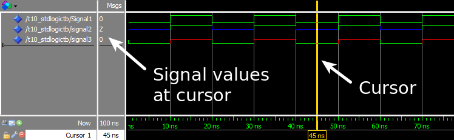

光标放置在重复信号周期另一处的波形视图：

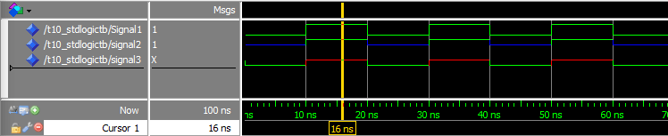

## 解析

该练习演示了VHDL的解析功能如何与`std_logic`类型一起工作。当使用数字逻辑工作时，研究*波形*视图中的时间线往往比使用打印输出更实用。因此在本练习中我们使用ModelSim的波形视图来检查信号值。

第一个进程和`Signal1`仅用于改变第三个进程中驱动`Signal2`和`Signal3`的值。

第二个进程Driver A将持续尝试就`Signal2`驱动`'Z'`，就`Signal3`上驱动`'0'`。

第三个进程Driver B将交替驱动`'1'`和`'Z'`到`Signal2`和`Signal3`上。

我们在波形截图中看到，`Signal1`在`'0'`和`'1'`之间变化，因为只有一个进程在试图驱动该信号。我们还可以观察到，多驱动信号的解析依据VHDL代码中注释的解析表：

| 信号    | Driver A | Driver B | 结果 |
|---------|----------|----------|------|
| Signal2 | ‘Z’      | ‘Z’      | ‘Z’  |
| Signal2 | ‘Z’      | ‘1’      | ‘1’  |
| Signal3 | ‘0’      | ‘Z’      | ‘0’  |
| Signal3 | ‘0’      | ‘1’      | ‘X’  |

## 要点

- `std_logic` 是VHDL中最常见的、用来保存单比特值的类型。
- 把`std_logic` 信号看作是我们数字设计中的一条物理导线
- 如果多个进程试图驱动一个`std_logic`信号，其值由解析表决定

# [如何在VHDL中创建信号矢量：STD_LOGIC_VECTOR (HOW TO CREATE A SIGNAL VECTOR IN VHDL: STD_LOGIC_VECTOR)](https://vhdlwhiz.com/std_logic_vector/)

`std_logic_vector`类型可用于在VHDL中创建信号总线(signal buses)。`std_logic`是VHDL中最常用的类型，而`std_logic_vector`是它的数组版本。

虽然`std_logic`很适合建模能被一条线(wire)所表征的值，但对于实现表征进出组件(component)的线的集合来说，它并不太实用。`std_logic_vector`是复合类型，这意味着它是子元素(subelements)的集合。`std_logic_vector`类型的信号或变量可以包含任意数量的`std_logic`元素。

**本篇博文是[基础VHDL教程(Basic VHDL Tutorials)](https://vhdlwhiz.com/basic-vhdl-tutorials/) 的一部分。**

声明`std_logic_vector`信号的语法如下所示：

`signal <name> : std_logic_vector(<lsb> to <msb>) := <initial_value>;`

或者

`signal <name> : std_logic_vector(<msb> downto <lsb>) := <initial_value>;`

其中 `<name>`  是任意的信号名称，`<initial_value>`是可选的初始值。`<lsb>`是最低有效位(the least significant bit)的索引，`<msb>`是最高有效位 (the most significant bit)的索引。

`to`或 `downto`指定总线(bus)范围的方向，基本上是它的字节顺序(endianess)。 尽管两者效果一样好，但 VHDL 设计人员最常使用 `downto`来声明矢量。因此，我建议您在声明位矢量(bit vectors)时始终使用 `downto`以避免混淆。

VHDL中用于声明可以容纳一个字节(byte)的矢量信号的代码如下所示：
`signal MySlv : std_logic_vector(7 downto 0);`

VHDL中用于声明可容纳一位(bit)的矢量信号的代码如下所示：
`signal MySlv : std_logic_vector(0 downto 0);`

VHDL中用于声明可以包含零位（*空范围*）的矢量信号的代码如下所示：
`signal MySlv : std_logic_vector(-1 downto 0);`

## 练习

本视频教程将告诉你如何声明`std_logic_vector`信号并赋予初值。我们还学习了如何使用 For 循环迭代矢量中的位(bits)来创建*移位寄存器(shift register)*：

<https://youtu.be/0w2G8Q4LVAs>

我们在本教程中创建的代码最终如下所示：

```vhdl
library ieee;
use ieee.std_logic_1164.all;
 
entity T11_StdLogicVectorTb is
end entity;
 
architecture sim of T11_StdLogicVectorTb is
 
    signal Slv1 : std_logic_vector(7 downto 0);
    signal Slv2 : std_logic_vector(7 downto 0) := (others => '0');
    signal Slv3 : std_logic_vector(7 downto 0) := (others => '1');
    signal Slv4 : std_logic_vector(7 downto 0) := x"AA";
    signal Slv5 : std_logic_vector(0 to 7)     := "10101010";
    signal Slv6 : std_logic_vector(7 downto 0) := "00000001";
 
begin
 
    -- Shift register
    process is
    begin
 
        wait for 10 ns;
 
        for i in Slv6'left downto Slv6'right + 1 loop
            Slv6(i) <= Slv6(i-1);
        end loop;
 
        Slv6(Slv6'right) <= Slv6(Slv6'left);
 
    end process;
 
end architecture;
```

按下运行键后，ModelSim中放大时间线后的波形视图如下所示：

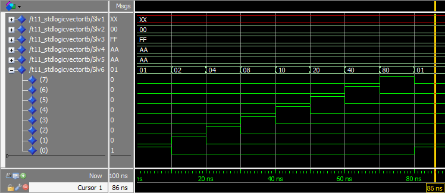

## 解析

在本练习中，我们声明了六个 `std_logic_vector`总线，每个总线八位长（即一个字节）。

信号 `Slv1`声明时没有初始值，在波形视图截图中可以看到总线的值为 XX。这是因为总线上显示的值是十六进制的，而XX表示非十六进制值。但是当我们展开波形视图中的总线时，我们可以看到各个位确实是 U。

信号 `Slv2`声明时使用全0的初始值。我们没有为每一位指定确切的值，而是使用`(other => '0')`代替初始值。这称为`聚合(aggregate)`赋值，关键点是它将向量中的所有位设置为您指定的任意长的任何值。

信号`Slv3`声明时使用聚合赋值，为所有位赋予初始值 1。我们可以在波形中看到此信号上显示的 FF，它就是八个 1 的十六进制表示。

信号`Slv4` 声明为十六进制 AA 中对应的初始值。每个十六进制数字的长度为 4 位(bit)，因此我们必须为 8 位长的矢量提供两个十六进制数字 (AA)。

信号`Slv5`声明的初始值与`Slv4`完全相同，但现在我们将其指定为二进制值10101010。从波形中我们可以看出两个信号的十六进制值都是 AA。

信号`Slv6`被声明为除了最右边的位是`'1'`，其余位全零的初始值。我们使用一个进程基于该信号创建`移位寄存器(shift register)`。移位寄存器，顾名思义每10纳秒将矢量的内容向左移动一位。

我们的进程每 10 ns 唤醒一次，For循环将向量中的所有位向左移动一位。最后一位通过`Slv6(Slv6'right) <= Slv6(Slv6'left);`移回第一个索引位置。我们可以在波形视图中看到`'1'`波纹穿过矢量。

`'1'`如何通过移位寄存器传播的过程可视化如下：


通过使用`'left`和`'right`属性(attribute)，我们使代码更加通用。如果我们改变`Sig6`的宽度，进程仍然有效。在设计实践中尽可能地使用属性(attribute)而不是硬编码值(hardcoding value)。

你可能想了解是否有更多的属性可以使用，请 [点此查看(there are)](https://www.csee.umbc.edu/portal/help/VHDL/attribute.html)。我不会在本教程系列中详细介绍它们，因为我认为它们是VHDL的高级功能。

## 要点

- N 位向量应使用`std_logic_vector(N-1 downto 0)`声明
- 向量可以作为一个整体赋值，也可以单独访问其中的各位
- 矢量中的所有位都可以通过使用聚合赋值`(others => '0')`来置零
- 通过使用诸如`'left`和`'right`之类的属性，代码可以变得更通用

[参加VHDL基础测试--第二章(Take the Basic VHDL Quiz – part 2 »)](https://vhdlwhiz.com/basic-vhdl-quiz-part-2/)

# [如何在VHDL中使用有符号数据和无符号数据 (HOW TO USE SIGNED AND UNSIGNED IN VHDL)](https://vhdlwhiz.com/signed-unsigned/)

就像 std_logic_vector 类型一样，VHDL 中的有符号(signed)和无符号(unsigned)类型是位矢量(bit vectors)。 不同之处在于，虽然 std_logic_vector 非常适合实现数据总线(data buses)，但它对实现算术运算毫无用处。

如果您尝试将任何数字添加到 std_logic_vector 类型，ModelSim 将产生编译错误：No feasible entries for infix operator “+”。这是因为编译器不知道如何解释矢量的位集合(collection of bits)。

**本篇博文是[基础VHDL教程(Basic VHDL Tutorials)](https://vhdlwhiz.com/basic-vhdl-tutorials/) 的一部分。**

我们必须将我们的矢量声明为有符号(signed)或无符号(unsigned)类型，以便编译器将其视为数字。

声明signed和unsigned信号的语法如下所示：

```vhdl
signal <name> : signed(<N-bits> downto 0) := <initial_value>;
signal <name> : unsigned(<N-bits> downto 0) := <initial_value>;
```

就像 std_logic_vector 一样，范围可以用`to`或`downto`表示任何范围。但是声明除`downto 0`  之外的其他范围的信号很罕见，以至于在这个问题上深究只会让我们感到困惑。初始值是可选的，默认情况下所有位都初始化为`'U'`。

在之前的教程中，我们已经使用`integer`类型进行算术运算。那么为什么我们需要signed和unsigned类型呢？ 首先，对于大多数数字设计师，他们喜欢更好地控制信号实际使用的位数。

此外，signed和unsigned类型会对溢出值进行回绕处理(wrap around)，而如果`integer`递增超出特定范围，仿真器将抛出运行错误(run-time error)。最后，signed和unsigned可以表示如`'U'`和`'X'`的其他值，而integer只能表征数字值，而signed和unsigned所能表征的这些元值(meta-values)可以帮助我们发现设计中的错误。

## 练习

本视频教程将告诉你signed 和unsigned信号的相似之处以及不同表现：

<https://youtu.be/qyx-DAewCQw>

我们在本教程中创建的代码最终如下所示：

```vhdl
library ieee;
use ieee.std_logic_1164.all;
use ieee.numeric_std.all;
 
entity T12_SignedUnsignedTb is
end entity;
 
architecture sim of T12_SignedUnsignedTb is
 
    signal UnsCnt : unsigned(7 downto 0) := (others => '0');
    signal SigCnt : signed(7 downto 0)   := (others => '0');
     
    signal Uns4   : unsigned(3 downto 0) := "1000";
    signal Sig4   : signed(3 downto 0)   := "1000";
     
    signal Uns8   : unsigned(7 downto 0) := (others => '0');
    signal Sig8   : signed(7 downto 0)   := (others => '0');
 
begin
 
    process is
    begin
 
        wait for 10 ns;
         
        -- Wrapping counter
        UnsCnt <= UnsCnt + 1;
        SigCnt <= SigCnt + 1;
         
        -- Adding signals
        Uns8 <= Uns8 + Uns4;
        Sig8 <= Sig8 + Sig4;
 
    end process;
end architecture;
```

ModelSim中放大感兴趣部分的波形视图如下所示：

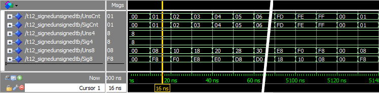

## 解析

波形视图中所有信号的基数都设置为十六进制，以便我们平等地比较。

在回绕计数器(wrapping counter)示例中，我们看到signed和unsigned信号的行为方式完全相同。`UnsCnt`和`SigCnt`都从 0 开始计数，并逐一增加到 FF。十六进制 FF（即十进制 255）是8 位信号所能容纳的最大值。因此，下一个增量将它们都环绕回 0。

我们创建了两个 4 位信号 `Uns4`和`Sig4`，并给它们都赋予了初始值“1000”。我们可以从波形视图中看出它们表示的是十六进制的 8（即二进制的 1000）。

我们创建的最后两个 8 位信号是 `Uns8`和`Sig8`。 我们可以从波形视图中看出它们的初始值就是预期中的 0。但是之后他们的行为就不同了！显然，signed和unsigned类型数据在添加两个不同长度的信号时会有所不同。

这是因为*符号扩展(sign extension)*。将存储在等长矢量中的正数或负数相加的运算与数字逻辑中的运算相同。这是因为[二进制补码(two’s complement)](https://en.wikipedia.org/wiki/Two's_complement) 的工作原理。如果向量的长度不同，则必须扩展最短的矢量。

Unsigned类型的 4 位二进制数“1000”对应十进制的 8，而signed类型的 4 位二进制数“1000”是十进制的 -8，因为signed类型数最左边的“1”表示这是一个负数。因此，编译器对这两个 4 位信号进行了不同的符号扩展。

符号扩展(sign extension)如何为 `Uns8`和`Sig8` 信号创建不同值的可视化如下所示：


## 要点

- 有符号(signed)和无符号(unsigned)类型的信号是可用于算术运算的矢量
- 有符号(signed)和无符号(unsigned)类型的信号溢出时不会报错
- 符号扩展(sign extension)可能会导致有符号和无符号类型数据得到不同的结果

# [如何在VHDL中创建并行语句 (HOW TO CREATE A CONCURRENT STATEMENT IN VHDL)](https://vhdlwhiz.com/concurrent-statement/)

VHDL 中的并行语句是架构内、但在正常进程框架之外的信号赋值。并行语句也称为并发赋值或并发进程。

当您创建一个并发语句时，您实际上是在创建一个具有某些明确定义特征的进程。并行语句总是等同于使用敏感列表的进程，其中信号赋值运算符右侧的所有信号都在敏感列表中。

当您想要创建给单个信号赋值的简单逻辑时，这些简化符号的进程很有用。无需完整输入使用敏感列表的进程构造，您可以直接在架构中简单地赋值给目标信号。

**本篇博文是[基础VHDL教程(Basic VHDL Tutorials)](https://vhdlwhiz.com/basic-vhdl-tutorials/) 的一部分。**

如果使用得当，代码的意图仍然非常清晰，无需为要翻转的每一位单独创建一个进程。

## 练习

本视频教程将告诉你如何创建一个并行语句：

<https://youtu.be/8Bi3q3k687A>

我们在本教程中创建的代码最终如下所示：

```vhdl
library ieee;
use ieee.std_logic_1164.all;
use ieee.numeric_std.all;
 
entity T13_ConcurrentProcsTb is
end entity;
 
architecture sim of T13_ConcurrentProcsTb is
 
    signal Uns :  unsigned(5 downto 0) := (others => '0');
    signal Mul1 : unsigned(7 downto 0);
    signal Mul2 : unsigned(7 downto 0);
    signal Mul3 : unsigned(7 downto 0);
 
begin
 
    process is
    begin
 
        Uns <= Uns + 1;
 
        wait for 10 ns;
    end process;
 
    -- Process multiplying Uns by 4
    process is
    begin
 
        Mul1 <= Uns & "00";
 
        wait on Uns;
 
    end process;
 
    -- Equivalent process using sensitivity list
    process(Uns) is
    begin
 
        Mul2 <= Uns & "00";
 
    end process;
 
    -- Equivalent process using a concurrent statement
    Mul3 <= Uns & "00";
 
end architecture;
```

按下运行键后，ModelSim中放大时间线后的波形视图如下所示：

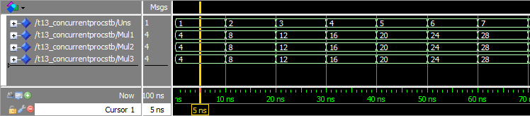

## 解析

我们可以从波形中看到 `Mul1`、`Mul2` 和`Mul3`的行为完全相同，这是因为并发语句和我们创建的两个进程是等价的。

并发语句就像进程一样工作。`<=`右侧的所有信号都会自动添加到敏感列表(sensitivity list)中。这意味着只要敏感列表中的信号之一发生变化，`<=` 左侧的信号就会更新。

在 VHDL 中有很多种数字相乘的方法。 在本练习中，我们使用数位偏移(bit shifting)将`Uns`信号乘以 4。我们所有的信号都是`unsigned`类型，这意味着它们由数字解释。在二进制数的右边附加一个 0 相当于将它乘以 2。

波形视图中光标处发生情况的说明如下所示：


## 要点

- 并发语句直接在架构(architecture)区域中进行信号赋值
- 并发语句相当于一个进程，所有评估的信号都在敏感列表上

# [如何在VHDL 中使用CASE-WHEN语句 (HOW TO USE A CASE-WHEN STATEMENT IN VHDL)](https://vhdlwhiz.com/case-when/)

Case-When语句将引导程序根据信号、变量或表达式的值从多个不同的路径中选择一个。它是编写多个 Elsif分支 的 If-Then-Elsif-Else 语句的更优雅替代方案。

其他编程语言也有类似的结构，使用诸如*switch*、*case*或*select* 等关键字。而Case-When 语句通常用于在 VHDL 中实现多路转接器。请继续阅读，或观看视频以了解如何实现！

**本篇博文是[基础VHDL教程(Basic VHDL Tutorials)](https://vhdlwhiz.com/basic-vhdl-tutorials/) 的一部分。**

Case-When语句的基本语法如下所示：

```vhdl
case <expression> is
 when <choice> =>    
  code for this branch  
 when <choice> =>    
  code for this branch  
 ...
end case;
```

`<expression>`  通常是变量或信号。 Case语句可能包含多个 `when` 选择，但只会选择其中之一。

`<choice>`可以是一个单独的值，例如 `"11"`:

`when "11" =>`

或者是一个范围，如 `5 到 10`:

`when 5 to 10 =>`

它可以包含几个值，如 `1|3|5`:

`when 1|3|5 =>`

最重要的是，`<choice>`为`others`，只要没有其他选择匹配，它就会被选中：

`when others =>`

`<choice>`相当于语句中的分支，`<choice>`置于`others`等同于If-Then-Elsif-Else语句中的`Else`分支。

## 练习

本视频教程将告诉你如何在VHDL中用Case-When语句创建一个多路转接器(multiplexer)：

<https://youtu.be/uLlmUZDpGNw>

我们在本教程中创建的代码最终如下所示：

```vhdl
library ieee;
use ieee.std_logic_1164.all;
use ieee.numeric_std.all;
 
entity T14_CaseWhenTb is
end entity;
 
architecture sim of T14_CaseWhenTb is
 
    signal Sig1 : unsigned(7 downto 0) := x"AA";
    signal Sig2 : unsigned(7 downto 0) := x"BB";
    signal Sig3 : unsigned(7 downto 0) := x"CC";
    signal Sig4 : unsigned(7 downto 0) := x"DD";
 
    signal Sel : unsigned(1 downto 0) := (others => '0');
 
    signal Output1 : unsigned(7 downto 0);
    signal Output2 : unsigned(7 downto 0);
 
begin
 
    -- Stimuli for the selector signal
    process is
    begin
        wait for 10 ns;
        Sel <= Sel + 1;
        wait for 10 ns;
        Sel <= Sel + 1;
        wait for 10 ns;
        Sel <= Sel + 1;
        wait for 10 ns;
        Sel <= Sel + 1;
        wait for 10 ns;
        Sel <= "UU";
        wait;
    end process;
 
    -- MUX using if-then-else
    process(Sel, Sig1, Sig2, Sig3, Sig4) is
    begin
 
        if Sel = "00" then
            Output1 <= Sig1;
        elsif Sel = "01" then
            Output1 <= Sig2;
        elsif Sel = "10" then
            Output1 <= Sig3;
        elsif Sel = "11" then
            Output1 <= Sig4;
        else -- 'U', 'X', '-' etc.
            Output1 <= (others => 'X');
        end if;
 
    end process;
 
    -- Equivalent MUX using a case statement
    process(Sel, Sig1, Sig2, Sig3, Sig4) is
    begin
 
        case Sel is
            when "00" =>
                Output2 <= Sig1;
            when "01" =>
                Output2 <= Sig2;
            when "10" =>
                Output2 <= Sig3;
            when "11" =>
                Output2 <= Sig4;
            when others => -- 'U', 'X', '-', etc.
                Output2 <= (others => 'X');
        end case;
 
    end process;
 
end architecture;
```

按下运行键后，ModelSim中放大时间线后的波形视图如下所示：

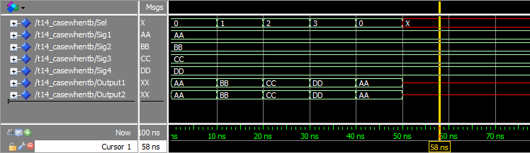

当我们在ModelSim中按下运行(run)按钮时，仿真器控制台(console)的输出：

```tcl
VSIM 2> run
# ** Warning: NUMERIC_STD."=": metavalue detected, returning FALSE
#    Time: 50 ns  Iteration: 1  Instance: /t14_casewhentb
# ** Warning: NUMERIC_STD."=": metavalue detected, returning FALSE
#    Time: 50 ns  Iteration: 1  Instance: /t14_casewhentb
# ** Warning: NUMERIC_STD."=": metavalue detected, returning FALSE
#    Time: 50 ns  Iteration: 1  Instance: /t14_casewhentb
# ** Warning: NUMERIC_STD."=": metavalue detected, returning FALSE
#    Time: 50 ns  Iteration: 1  Instance: /t14_casewhentb
```

## 解析

首先，我们使用If-Then-Elsif-Else创建一个进程，它将根据选择器信号`Sel`的值，转发`Sig1`、`Sig2`、`Sig3`或`Sig4`中的某一信号。

然后我们创建另一个流程，使用Case-When语句，实现完全相同的功能。我们可以从波形图中观察到，两个进程的输出信号，即`Output1`和`Output2`，表现得完全一样。

在我们的例子中，`Sel`信号只有四个合法值。但如果有更多的可能取值，可以很容易地看到，Case-When语句可以使代码更易读、易于理解。所以其是大多数VHDL设计者创建这类组件的首选方式。

对*多路复用器*的理解是本练习的额外知识点。多路复用器(MUX)是数字设计中的核心部件。它只是一个开关，选择若干输入中的一个，并将其转发到输出。

下面是关于MUX如何转发所选输入信号的说明：

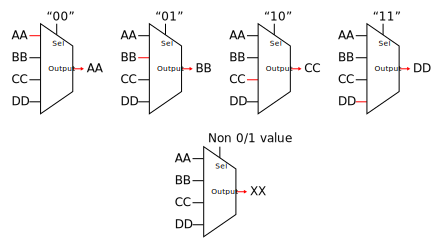

我们使用`others` 子句来捕捉`Sel` 的所有非1或0的值。正如我们在 [std_logic教程(std_logic tutorial)](https://vhdlwhiz.com/std_logic/)中所学，信号可以具有多个非`'0'` 或 `'1'`的值。设计实践中可以输出`'X'`来处理这些值。`'X'`表示此信号的值未知，并且将在下游逻辑中可见。

从波形视图中可以看出，当`Sel`信号变红时，`Output1`和`Output2`也变为`"XX"`，这是`when others =>` 工作的结果。

此外，由于`Sel`信号被设置为`"UU"`，ModelSim 中的控制台输出显示警告。“** Warning: NUMERIC_STD.”=”: metavalue detected, returning FALSE” 出现在仿真时间50 ns，即信号变红的时间。

## 要点

- 可以使用 Case-When 代替多个 If-Then-Elsif 语句
- `when others =>`用于实现默认选择
- 最好使用 Case-When 语句创建多路复用器

# [如何在VHDL中使用端口映射实例化(HOW TO USE PORT MAP INSTANTIATION IN VHDL)](https://vhdlwhiz.com/port-map/)

模块(module)是VHDL代码中的独立单元，其通过`实体(entity)`与外部世界进行通信。`端口映射(Port map)`是模块实例化的一部分，可以在其中声明模块的输入和输出应连接到哪些本地信号。

在本系列靠前教程中，我们一直在主VHDL文件中写所有的代码，但通常我们不会这样做。我们创建逻辑的目的是在FPGA或ASIC设计中使用它，而不是为了在仿真器中运行。
一个为在仿真器中运行而创建的VHDL模块通常没有输入或输出信号，它是完全独立的，这就是为什么我们设计的实体一直是空的。在`entity`标签和`end entity;` 标签之间没有任何代码。

**本篇博文是[基础VHDL教程(Basic VHDL Tutorials)](https://vhdlwhiz.com/basic-vhdl-tutorials/) 的一部分。**

一个没有任何输入或输出信号的模块不能用于实际设计中，它的唯一目的是让我们在仿真器中运行VHDL代码。因此，它被称为*测试文件(testbench)*。为了模拟一个有输入和输出信号的模块，我们必须在测试文件中把它*实例化(instantiate)*。

模块(modules)和测试文件(testbenches)经常成对出现，它们被存储在不同的文件中。一个常见的命名方案是将测试文件命名为模块名称加上“Tb”，并将架构命名为“sim”。如果模块被称为“MyModule”，测试文件将被称为“MyModuleTb”。因此，文件名变成 “MyModuleTb.vhd”和“MyModule.vhd”。

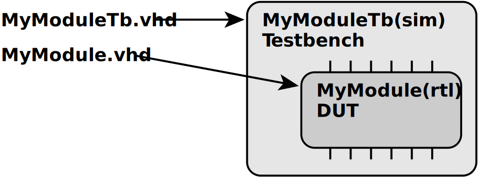

在testbench代码的帮助下，我们可以验证module在仿真环境中是否正常工作。被测试的module通常被称为*被测设备(device under test, DUT)*。

模块也可以在其他模块中被实例化。将代码分割成模块可以使其多次实例化。你可以在同一个设计中创建一个模块的多个实例，并且可以在之后的众多设计中重复使用。

带有端口(port)的实体在VHDL中的语法如下所示：

```vhdl
entity <entity_name> is
port(  
 <entity_signal_name> : in|out|inout <signal_type>;  
 ...
);
end entity;
```

在另一个VHDL文件中实例化该模块的语法如下所示：

```vhdl
<label> : entity <library_name>.<entity_name>(<architecture_name>) port map(  
 <entity_signal_name> => <local_signal_name>,
 ...
);
```

`<label>`可以是任何名字，它将显示在ModelSim的层级(hierarchy)视图中。模块的`<library_name>`是在仿真器中设置，而不是在VHDL代码中设置。默认情况下，每个模块都被编译到`work`库中。`<entity_name>`和`<architecture_name>`必须与我们要创建实例的模块匹配。最后，每个实体信号必须被映射到一个本地信号名。

在VHDL中还有其他方法来实例化一个模块，但本部分是显式实例化的基本语法。

## 练习

本视频教程将告诉你如何在VHDL中创建并实例化模块：

<https://youtu.be/Ts1be5-T5u4>

MUX*测试文件(testbench)*的最终代码如下所示：

```vhdl
library ieee;
use ieee.std_logic_1164.all;
use ieee.numeric_std.all;
 
entity T15_PortMapTb is
end entity;
 
architecture sim of T15_PortMapTb is
 
    signal Sig1 : unsigned(7 downto 0) := x"AA";
    signal Sig2 : unsigned(7 downto 0) := x"BB";
    signal Sig3 : unsigned(7 downto 0) := x"CC";
    signal Sig4 : unsigned(7 downto 0) := x"DD";
 
    signal Sel : unsigned(1 downto 0) := (others => '0');
 
    signal Output : unsigned(7 downto 0);
 
begin
 
    -- An instance of T15_Mux with architecture rtl
    i_Mux1 : entity work.T15_Mux(rtl) port map(
        Sel    => Sel,
        Sig1   => Sig1,
        Sig2   => Sig2,
        Sig3   => Sig3,
        Sig4   => Sig4,
        Output => Output);
 
    -- Testbench process
    process is
    begin
        wait for 10 ns;
        Sel <= Sel + 1;
        wait for 10 ns;
        Sel <= Sel + 1;
        wait for 10 ns;
        Sel <= Sel + 1;
        wait for 10 ns;
        Sel <= Sel + 1;
        wait for 10 ns;
        Sel <= "UU";
        wait;
    end process;
 
end architecture;
```

MUX*模块(module)*的最终代码如下所示：

```vhdl
library ieee;
use ieee.std_logic_1164.all;
use ieee.numeric_std.all;
 
entity T15_Mux is
port(
    -- Inputs
    Sig1 : in unsigned(7 downto 0);
    Sig2 : in unsigned(7 downto 0);
    Sig3 : in unsigned(7 downto 0);
    Sig4 : in unsigned(7 downto 0);
 
    Sel  : in unsigned(1 downto 0);
 
    -- Outputs
    Output : out unsigned(7 downto 0));
end entity;
 
architecture rtl of T15_Mux is
begin
 
    process(Sel, Sig1, Sig2, Sig3, Sig4) is
    begin
 
        case Sel is
            when "00" =>
                Output <= Sig1;
            when "01" =>
                Output <= Sig2;
            when "10" =>
                Output <= Sig3;
            when "11" =>
                Output <= Sig4;
            when others => -- 'U', 'X', '-', etc.
                Output <= (others => 'X');
        end case;
 
    end process;
 
end architecture;
```

按下运行键后，ModelSim中放大时间线后的波形视图如下所示：

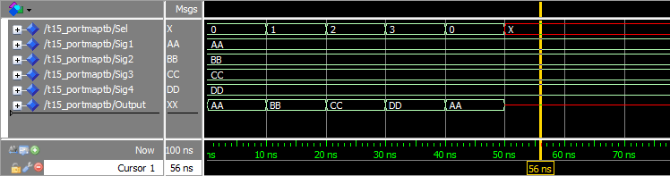

## 解析

从波形中我们可以看到，多路复用器(MUX)模块按预期正常工作。本波形与[之前教程(previous tutorial)](https://vhdlwhiz.com/case-when/) 中的波形是一样的，而我们没有使用模块来创建。

现在，设计模块和测试文件之间有了明确的分离。包含MUX的模块是我们打算在设计中所使用的，而测试文件的唯一目的是让我们在仿真器中运行它。在测试文件(testbench)中有一个进程，其使用`wait`语句在模拟中创建人工时间延迟。设计模块(module)没有时间的概念，它只对外部刺激做出反应。

我们将测试平台用于模拟的架构命名为`sim`。设计模块(module)的架构(architecture)被命名为`rtl`，即[寄存器传输级别(register-transfer level)](https://en.wikipedia.org/wiki/Register-transfer_level)，这也只是命名习惯。当你看到一个有这样名字的文件时，你应该知道它是测试文件或设计模块。当然不同的公司可能有不同的命名习惯。

## 要点

- 输入和输出信号在模块(module)的实体(entity)中被指定
- 没有输入/输出信号的模块被称为*测试文件(testbench)*，它只能在仿真器中使用
- 带有输入/输出信号的模块通常不能直接在仿真器中运行

# [如何在VHDL中使用常量和类属 (HOW TO USE CONSTANTS AND GENERIC MAP IN VHDL)](https://vhdlwhiz.com/constants-generic-map/)

创建模块是重用代码的好方法，但您通常需要在整个设计中使用仅有较小变化的相同模块。这就是类属和类属映射的用途。它允许您在编译时使模块的某些部分可配置。

当我们想避免重复输入相同的值时，就会用到常量。它们可以用来在编译时定义信号矢量的位宽，甚至还可以映射到类属常量(generic constants)。常量可以用来代替代码中任何地方的信号和变量，但它们的值在编译后不能被改变。

**本篇博文是[基础VHDL教程(Basic VHDL Tutorials)](https://vhdlwhiz.com/basic-vhdl-tutorials/) 的一部分。**

在[上一教程(previous tutorial)](https://vhdlwhiz.com/port-map/)中，我们创建了一个总线宽度为 8 位的 4 输入多路转接器模块。 但是，如果我们还需要一个具有不同总线宽度的类似 MUX 时该怎么办？ 将代码复制粘贴为新模块并更改数字是唯一解决方案吗？

幸运的是，不用如此复杂。

在VHDL中创建常量的语法如下所示：

`constant <constant_name> : <type> := <value>;`

常量可以在 VHDL 文件的声明部分与信号一起声明，也可以在进程中与变量一起声明。

可以使用`generic`关键字通过实体将常量传递到模块中。为接受类属常量的模块创建实体的语法如下所示：

```vhdl
entity <entity_name> is
generic(
 <entity_constant_name> : <type> [:= default_value];  
 ...
);
port(
 <entity_signal_name> : in|out|inout <type>;
 ...
);
end entity;
```

在另一个VHDL文件中实例化一个类属模块的语法如下所示：

```vhdl
<label> : entity <library_name>.<entity_name>(<architecture_name>)
generic map(
 <entity_constant_name> => <value_or_constant>,
 ...
)
port map(
 <entity_signal_name> => <local_signal_name>,
 ...
);
```

## 练习

本视频教程将告诉你如何在VHDL中创建并初始化一个含有类属常量的模块：

<https://youtu.be/8_LGKCE5flQ>

类属MUX*测试文件(testbench)*的最终代码如下所示：

```vhdl
library ieee;
use ieee.std_logic_1164.all;
use ieee.numeric_std.all;
 
entity T16_GenericMapTb is
end entity;
 
architecture sim of T16_GenericMapTb is
 
    constant DataWidth : integer := 8;
 
    signal Sig1 : signed(DataWidth-1 downto 0) := x"AA";
    signal Sig2 : signed(DataWidth-1 downto 0) := x"BB";
    signal Sig3 : signed(DataWidth-1 downto 0) := x"CC";
    signal Sig4 : signed(DataWidth-1 downto 0) := x"DD";
 
    signal Sel : signed(1 downto 0) := (others => '0');
 
    signal Output : signed(DataWidth-1 downto 0);
 
begin
 
    -- An Instance of T16_GenericMux with architecture rtl
    i_Mux1 : entity work.T16_GenericMux(rtl)
    generic map(DataWidth => DataWidth)
    port map(
        Sel    => Sel,
        Sig1   => Sig1,
        Sig2   => Sig2,
        Sig3   => Sig3,
        Sig4   => Sig4,
        Output => Output);
 
    -- Testbench process
    process is
    begin
        wait for 10 ns;
        Sel <= Sel + 1;
        wait for 10 ns;
        Sel <= Sel + 1;
        wait for 10 ns;
        Sel <= Sel + 1;
        wait for 10 ns;
        Sel <= Sel + 1;
        wait for 10 ns;
        Sel <= "UU";
        wait;
    end process;
 
end architecture;
```

类属MUX*模块(model)*的最终代码如下所示：

```vhdl
library ieee;
use ieee.std_logic_1164.all;
use ieee.numeric_std.all;
 
entity T16_GenericMux is
generic(DataWidth : integer);
port(
    -- Inputs
    Sig1 : in signed(DataWidth-1 downto 0);
    Sig2 : in signed(DataWidth-1 downto 0);
    Sig3 : in signed(DataWidth-1 downto 0);
    Sig4 : in signed(DataWidth-1 downto 0);
 
    Sel  : in signed(1 downto 0);
 
    -- Outputs
    Output : out signed(DataWidth-1 downto 0));
end entity;
 
architecture rtl of T16_GenericMux is
begin
 
    process(Sel, Sig1, Sig2, Sig3, Sig4) is
    begin
 
        case Sel is
            when "00" =>
                Output <= Sig1;
            when "01" =>
                Output <= Sig2;
            when "10" =>
                Output <= Sig3;
            when "11" =>
                Output <= Sig4;
            when others => -- 'U', 'X', '-', etc.
                Output <= (others => 'X');
        end case;
 
    end process;
 
end architecture;
```

按下运行键后，ModelSim中放大时间线后的波形视图如下所示：

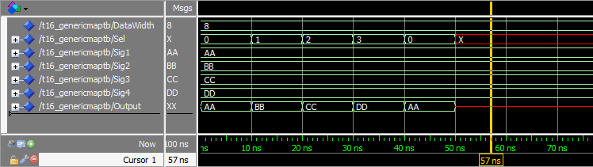

## 解析

我们创建了一个具有可配置总线宽度的MUX模块。现在总线宽度只在测试文件这一处指定。我们可以轻易地改变它来创建具有不同总线宽度的MUX。

如果我们将该波形与[上一个教程(previous tutorial)](https://vhdlwhiz.com/port-map/)中的波形进行比较，我们可以看到其表现是相同的。这是因为我们根本就没有改变代码功能。

## 要点

- 常量可以用来避免在多处硬编码(hard-code)数值
- 类属可以用来使模块的适应性更强

# [如何在VHDL中创建一个有时钟的进程 (HOW TO CREATE A CLOCKED PROCESS IN VHDL)](https://vhdlwhiz.com/clocked-process/)

绝大多数VHDL设计使用*时钟逻辑(clocked logic)*，也被称为*同步逻辑(synchronous logic)*或*顺序逻辑(sequential logic)*。一个有时钟的进程只由一个主时钟信号(master clock signal)触发，而不是在其他任何输入信号变化时触发。

时钟逻辑(clocked logic)的基本构件是一个叫做*触发器(flip-flop)*的组件(component)。它有不同的变体，在本教程中，我们将重点讨论负复位的正边触发触发器(positive-edge-triggered flip-flop with negative reset)。

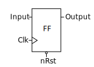

触发器是一个采样和保持(sample-and-hold)电路，这意味着当时钟信号的上升沿(rising edge)到达时，它将输入的数值复制到输出。然后输出被稳定在采样值上，直到下一个时钟上升沿，或者直到复位信号中出现脉冲。

**本篇博文是[基础VHDL教程(Basic VHDL Tutorials)](https://vhdlwhiz.com/basic-vhdl-tutorials/) 的一部分。**

所有的时钟进程同时被触发，并将一次性读取其输入，同时它们将输出上一次迭代的结果。时钟信号有效地在数据流中创建了时间步长。这使得设计者在创建复杂的、深层次的逻辑时容易管理。设计者可以将算法的行动分解为时钟周期上发生的事件。

触发器或触发器阵列(arrays of flip-flops)有时被称为*寄存器(registers)*，两者即同一件事。

时钟进程的敏感列表通常只包含时钟信号(clock signal)。这是因为时钟进程只被时钟信号的侧面(flank)触发，其他输入信号根本无法唤醒它。

一个用于创建具有同步复位功能的时钟进程的模板如下所示：

```vhdl
process(Clk) is
begin
 if rising_edge(Clk) then
  if nRst = '0' then
   <reset all output signals here>
  else
   <main logic here>
  end if;
 end if;
end process;
```

## 练习

本视频教程将告诉你如何在VHDL中创建带有时钟的进程：

<https://youtu.be/z6Biw6xai1E>

触发器*测试文件*的最终代码如下所示：

```vhdl
library ieee;
use ieee.std_logic_1164.all;
use ieee.numeric_std.all;

entity T17_ClockedProcessTb is
end entity;

architecture sim of T17_ClockedProcessTb is

    constant ClockFrequency : integer := 100e6; -- 100 MHz
    constant ClockPeriod    : time    := 1000 ms / ClockFrequency;

    signal Clk    : std_logic := '1';
    signal nRst   : std_logic := '0';
    signal Input  : std_logic := '0';
    signal Output : std_logic;

begin

    -- The Device Under Test (DUT)
    i_FlipFlop : entity work.T17_FlipFlop(rtl)
    port map(
        Clk    => Clk,
        nRst   => nRst,
        Input  => Input,
        Output => Output);

    -- Process for generating the clock
    Clk <= not Clk after ClockPeriod / 2;

    -- Testbench sequence
    process is
    begin
        -- Take the DUT out of reset
        nRst <= '1';

        wait for 20 ns;
        Input <= '1';
        wait for 22 ns;
        Input <= '0';
        wait for 6 ns;
        Input <= '1';
        wait for 20 ns;

        -- Reset the DUT
        nRst <= '0';

        wait;
    end process;

end architecture;
```

触发器*模块*的最终代码如下所示

```vhdl
library ieee;
use ieee.std_logic_1164.all;
use ieee.numeric_std.all;

entity T17_FlipFlop is
port(
    Clk    : in std_logic;
    nRst   : in std_logic; -- Negative reset
    Input  : in std_logic;
    Output : out std_logic);
end entity;

architecture rtl of T17_FlipFlop is
begin

    -- Flip-flop with synchronized reset
    process(Clk) is
    begin

        if rising_edge(Clk) then
            if nRst = '0' then
                Output <= '0';
            else
                Output <= Input;
            end if;
        end if;

    end process;

end architecture;
```

按下运行键后，ModelSim中放大时间线后的波形视图如下所示：

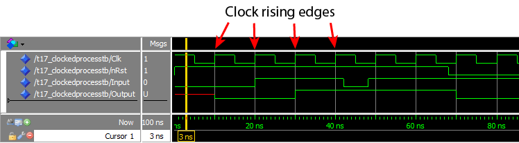

## 解析

我们可以从波形中看到，输出信号只在时钟信号的每个上升沿更新。只有当时钟信号从‘0’变为‘1’时，才对输入信号进行采样。而大约45ns处输入信号的下降波形被完全丢失。它没有被复制到输出端，因为它处于时钟的两个上升沿之间，故它被忽略了。

这个动画说明了输出是如何对变化的输入和时钟信号作出反应的：

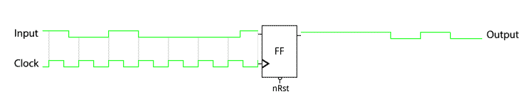

两者之间的灰色垂直线表示输入信号在时钟处于上升沿的取值。

请特别注意输入信号中从20ns开始的一个正脉冲，它与时钟同步，而且正好是一个时钟周期的长度。输出并没有即时反应，而是延迟了一个时钟周期。

当我在学习VHDL时，我发现这一点特别难以理解。时钟的上升沿与输入的上升沿是同步的，那么触发器是如何选择一个值或另一个值呢？

仿真器使用时间步长以可预测的方式模拟事件，而信号的传递不消耗时间。因为触发器在更新输出的同时也在读取输入，它看到了输入的旧值并将其复制到输出。

**[在此阅读更多关于VHDL中时间步长的信息：Delta周期解释(Read more about VHDL timesteps here: Delta cycles explained)](https://vhdlwhiz.com/delta-cycles-explained/)**

我应该对该答案进行补充，因为这并不是*真正的*工作方式，在真实的物理世界中，信号的传播需要时间，我们并不确切知道它何时到达触发器处。这些传播延迟是由将VHDL代码转换为网表(netlist)的软件过程（[布局布线place and route](https://en.wikipedia.org/wiki/Place_and_route#Field-programmable_gate_array)）自动为我们估计的。

在现实中，输入必须在时钟的上升沿前后的若干纳秒内保持稳定：


这段关键的时间称为[创建时间和维持时间(setup and hold time)](https://en.wikipedia.org/wiki/Flip-flop_(electronics)#Timing_considerations)。幸运的是，这通常不是我们需要考虑的事情。当纯粹使用时钟逻辑时，这些问题由将 VHDL 代码转换为网表的软件处理。

## 要点

- 具备同步重置功能的带时钟进程的敏感列表中仅有时钟信号
- `if rising_edge(Clk)`确保进程只在时钟的上升沿被唤醒
- 在同步设计中，事件只发生在活跃的时钟边沿

[参加VHDL基础测试--第三章(Take the Basic VHDL Quiz – part 3 »)](https://vhdlwhiz.com/basic-vhdl-quiz-part-3/)

# [如何在VHDL中创建计时器(HOW TO CREATE A TIMER IN VHDL)](https://vhdlwhiz.com/create-timer/)

在之前教程中，我们使用了`wait for`语句在仿真中延迟时间。但是对于用于实际生产模块呢？`wait for`语句并不能使用，也只在模拟中起作用，因为我们不能直接告诉电路中的电子器件延迟一定时间。那么，我们怎样才能让所设计的模块掌握时间呢？

答案就是计算时钟周期。每个数字设计都可以访问以固定的已知频率振荡的时钟信号。因此，如果我们知道时钟频率是100MHz，我们可以通过计算一亿个时钟周期来测量一秒。

**本篇博文是[基础VHDL教程(Basic VHDL Tutorials)](https://vhdlwhiz.com/basic-vhdl-tutorials/) 的一部分。**

为在 VHDL 中计算秒数，我们可以实现一个计数器来计算经过的时钟周期数。当计数器达到时钟频率值时，例如 1 亿，我们就知道一秒钟过去了。是时候增加另一个计数器了，我们称其为秒数计数器(Seconds counter)。

要计算分钟数，我们可以实现另一个分钟计数器(Minutes counter)，它会在每60秒过去后递增。同样，我们可以创建一个小时计数器(Hours counter)来计算小时数，它在每60 分钟过去后递增。

我们也可以继续拓展这种方法来计算天数、周数和月数。我们也受到底层技术中可用的物理资源，以及计数器长度与时钟频率的限制。

随着计数器长度的增加，它显然会消耗更多的资源。也因为事件链路变长，其反应也会变慢。

## 练习

本视频教程将告诉你如何在VHDL中创建计时器模块：

<https://youtu.be/fD90JSv-MbU>

计时器*测试文件*的最终代码如下所示：

```vhdl
library ieee;
use ieee.std_logic_1164.all;
use ieee.numeric_std.all;
 
entity T18_TimerTb is
end entity;
 
architecture sim of T18_TimerTb is
 
    -- We're slowing down the clock to speed up simulation time
    constant ClockFrequencyHz : integer := 10; -- 10 Hz
    constant ClockPeriod      : time := 1000 ms / ClockFrequencyHz;
 
    signal Clk     : std_logic := '1';
    signal nRst    : std_logic := '0';
    signal Seconds : integer;
    signal Minutes : integer;
    signal Hours   : integer;
 
begin
 
    -- The Device Under Test (DUT)
    i_Timer : entity work.T18_Timer(rtl)
    generic map(ClockFrequencyHz => ClockFrequencyHz)
    port map (
        Clk     => Clk,
        nRst    => nRst,
        Seconds => Seconds,
        Minutes => Minutes,
        Hours   => Hours);
 
    -- Process for generating the clock
    Clk <= not Clk after ClockPeriod / 2;
 
    -- Testbench sequence
    process is
    begin
        wait until rising_edge(Clk);
        wait until rising_edge(Clk);
 
        -- Take the DUT out of reset
        nRst <= '1';
 
        wait;
    end process;
 
end architecture;
```

计时器*模块*的最终代码如下所示：

```vhdl
library ieee;
use ieee.std_logic_1164.all;
use ieee.numeric_std.all;
 
entity T18_Timer is
generic(ClockFrequencyHz : integer);
port(
    Clk     : in std_logic;
    nRst    : in std_logic; -- Negative reset
    Seconds : inout integer;
    Minutes : inout integer;
    Hours   : inout integer);
end entity;
 
architecture rtl of T18_Timer is
 
    -- Signal for counting clock periods
    signal Ticks : integer;
 
begin
 
    process(Clk) is
    begin
        if rising_edge(Clk) then
 
            -- If the negative reset signal is active
            if nRst = '0' then
                Ticks   <= 0;
                Seconds <= 0;
                Minutes <= 0;
                Hours   <= 0;
            else
 
                -- True once every second
                if Ticks = ClockFrequencyHz - 1 then
                    Ticks <= 0;
 
                    -- True once every minute
                    if Seconds = 59 then
                        Seconds <= 0;
 
                        -- True once every hour
                        if Minutes = 59 then
                            Minutes <= 0;
 
                            -- True once a day
                            if Hours = 23 then
                                Hours <= 0;
                            else
                                Hours <= Hours + 1;
                            end if;
 
                        else
                            Minutes <= Minutes + 1;
                        end if;
 
                    else
                        Seconds <= Seconds + 1;
                    end if;
 
                else
                    Ticks <= Ticks + 1;
                end if;
 
            end if;
        end if;
    end process;
 
end architecture;
```

放大查看秒(`Seconds`)信号的波形：

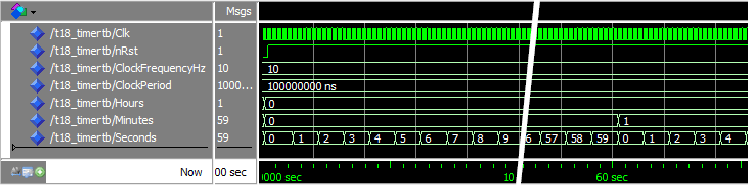

放大查看分(`Minutes`)信号的波形：

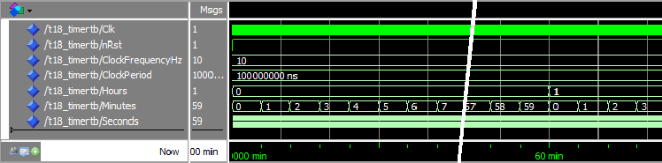

放大查看时(`Hours`)信号的波形：

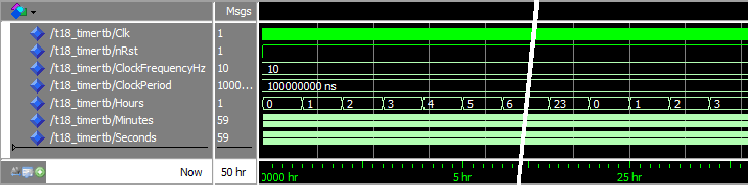

## 解析

为运行 50 小时的模拟，我们在 ModelSim 控制台中给出了`run 50 hr`的命令。50小时是一个非常长的模拟，因此我们不得不将测试文件中的时钟频率降低到 10 Hz。如果我们将其保持在 100 MHz，模拟将花费数天时间。有时需要进行此类调整以允许我们的设计进行模拟。

我们右击波形视图中的时间线，选择“Grid, Timeline & Cursor Control”。当将时间单位从纳秒变为秒、分、小时时，我们可以看到计时器确实是实时工作的。

由于在仿真开始时模块复位，计时器时间与仿真时间略有偏差。从第一个波形中可以看到，时间轴上的 60 秒标记稍早于秒(Seconds)信号回绕到 0 时。

请注意，在仿真中，计数器值在时钟上升沿的完全同步无延迟更新。在现实世界中，计数器值需要时间从计数器的第一位传播到最后一位。随着我们增加计数器的长度，我们消耗了一个时钟周期的可用时间。

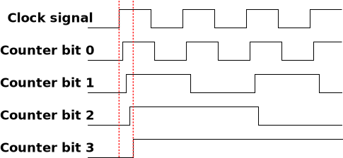

如果所有级联计数器的累加长度变得过长，编译后[布局布线(place and route)](https://en.wikipedia.org/wiki/Place_and_route) 步骤会产生错误。在消耗整个时钟周期之前您可以实施多长时间的计数器取决于FPGA或ASIC架构和时钟速度。

增加的时钟速度意味着计数器链将更长。这也意味着时钟周期时间将更短，使计数器链路完成的时间更短。

## 要点

- VHDL 模块中的时间测量是通过计算时钟周期来实现的
- 降低测试文件中的时钟频率将加速仿真

# [如何在VHDL中使用过程(HOW TO USE A PROCEDURE IN VHDL)](https://vhdlwhiz.com/using-procedure/)

过程(procedure)是VHDL中用于避免代码重复的一种子程序。当需要在整个设计的多处执行相同操作的时候，创建一个模块(module)对于出现次数少的运算来说可能有点矫枉过正，这时过程通常就是你所需的。

过程可以在任何声明区域内声明，过程的范围将限于它声明的任何地方、架构(architecture)、包(package)或进程(process)。每当你调用该过程时，效果就像该过程的代码被插入到调用处一样。

过程不像函数那样返回值，但你可以通过在参数列表(parameter list)中声明 `out`或`inout` 信号来返回值。

**本篇博文是[基础VHDL教程(Basic VHDL Tutorials)](https://vhdlwhiz.com/basic-vhdl-tutorials/) 的一部分。**

创建过程的基本语法如下所示：

```vhdl
procedure <procedure_name> (signal|variable|constant <name1> : in|out|inout <type>; 
 signal|variable|constant <name2> : in|out|inout <type>; 
...) is
 <declarations_for_use_within_the_procedure>
begin
 <code_performed_by_the_procedure_here>
end procedure;
```

过程的参数列表定义了其输入和输出，这有点像迷你模块(module)。它的输入和输出可以是信号(signal)或常量(constant)，但与模块不同的是，它还可以是变量(variable)。你可以在“is”和“begin”关键字之间声明仅在过程内部有效的对象，对象包括常量(constants)、变量(variables)、类型(types)、子类型(subtypes)和别名(aliases)，但不包括信号(signals)。

与函数不同，过程可能包含wait语句。因此，过程通常用于测试文件(testbenches)，例如用于模拟接口的简单[总线功能模型(bus functional model, BFM’s )](https://en.wikipedia.org/wiki/Bus_Functional_Model)，或用于检查被测设备 (device under test, DUT) 的输出。

## 练习

在[上一教程(previous tutorial)](https://vhdlwhiz.com/create-timer/)中，我们使用嵌套的 If-Then-Else 语句创建计时器模块。If-Then-Else 中的每一层 If-Then-Else 都增加了设计的复杂性，并降低代码可读性。在每一层逻辑上，我们基本上都是对一组不同信号进行相同操作。有没有更好的方法来实现这一点？

本视频教程将告诉你如何在VHDL中创建过程：

<https://youtu.be/P2I5Yu2x-iY>

在本教程中创建的*测试文件*代码最终如下所示

```vhdl
library ieee;
use ieee.std_logic_1164.all;
use ieee.numeric_std.all;
 
entity T19_ProcedureTb is
end entity;
 
architecture sim of T19_ProcedureTb is
 
    -- We're slowing down the clock to speed up simulation time
    constant ClockFrequencyHz : integer := 10; -- 10 Hz
    constant ClockPeriod : time := 1000 ms / ClockFrequencyHz;
 
    signal Clk     : std_logic := '1';
    signal nRst    : std_logic := '0';
    signal Seconds : integer;
    signal Minutes : integer;
    signal Hours   : integer;
 
begin
 
    -- The Device Under Test (DUT)
    i_Timer : entity work.T19_Timer(rtl)
    generic map(ClockFrequencyHz => ClockFrequencyHz)
    port map (
        Clk     => Clk,
        nRst    => nRst,
        Seconds => Seconds,
        Minutes => Minutes,
        Hours   => Hours);
 
    -- Process for generating clock
    Clk <= not Clk after ClockPeriod / 2;
 
    -- Testbench sequence
    process is
    begin
        wait until rising_edge(Clk);
        wait until rising_edge(Clk);
 
        -- Take the DUT out of reset
        nRst <= '1';
 
        wait;
    end process;
 
end architecture;
```

在本教程中创建的使用过程的计时器*模块*的代码最终如下所示

```vhdl
library ieee;
use ieee.std_logic_1164.all;
use ieee.numeric_std.all;
 
entity T19_Timer is
generic(ClockFrequencyHz : integer);
port(
    Clk     : in std_logic;
    nRst    : in std_logic; -- Negative reset
    Seconds : inout integer;
    Minutes : inout integer;
    Hours   : inout integer);
end entity;
 
architecture rtl of T19_Timer is
 
    -- Signal for counting clock periods
    signal Ticks : integer;
 
    procedure IncrementWrap(signal   Counter   : inout integer;
                            constant WrapValue : in    integer;
                            constant Enable    : in    boolean;
                            variable Wrapped   : out   boolean) is
    begin
        Wrapped := false;
        if Enable then
            if Counter = WrapValue - 1 then
                Wrapped := true;
                Counter <= 0;
            else
                Counter <= Counter + 1;
            end if;
        end if;
    end procedure;
 
begin
 
    process(Clk) is
        variable Wrap : boolean;
    begin
        if rising_edge(Clk) then
 
            -- If the negative reset signal is active
            if nRst = '0' then
                Ticks   <= 0;
                Seconds <= 0;
                Minutes <= 0;
                Hours   <= 0;
            else
 
                -- Cascade counters
                IncrementWrap(Ticks, ClockFrequencyHz, true, Wrap);
                IncrementWrap(Seconds,             60, Wrap, Wrap);
                IncrementWrap(Minutes,             60, Wrap, Wrap);
                IncrementWrap(Hours,               24, Wrap, Wrap);
 
            end if;
        end if;
    end process;
 
end architecture;
```

在`Minutes`信号回绕处时间轴放大的ModelSim 波形视图：

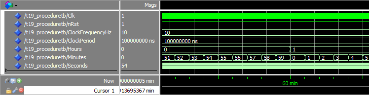

## 解析

我们可以从波形视图中看到，信号的回绕(wrapping)仍然像上一个教程中那样起作用。因为我们实际上没有改变模块上的函数，只是改变了它的实现方式。

`IncrementWrap`过程的参数列表中的第一项是`Counter`信号。它使用`inout`方向声明，以便过程能够读取和设置它的值。

参数列表中的第二项和第三项是常量，意味着你在此处输入的值将在过程*内部*表现为常量。`WrapValue`输入与`Enable` 输入共同决定了`Counter`信号是递增(incremented)还是回绕 (wrapped)。

参数列表中的最后一项是`out`方向的变量。此输出的目的是通知调用者计数器回绕的过程。我们在这里以类似返回值的方式使用它。

在主进程中，我们有四次调用 `IncrementWrap`过程，每个后续调用都使用 `Wrap`变量来启用计数。如果我们使用信号而不是变量，它就不会起作用，因为信号值仅在进程进入睡眠状态时更新。我们需要将过程调用的输出值用作下一行调用的输入，因此它必须是变量。

## 要点

- 过程可以用作迷你模块以避免复制粘贴代码
- 过程的（输入/输出）参数可以是信号、变量或常量
- 与函数不同，过程可以包含wait语句

# [如何在VHDL中创建有限状态机(HOW TO CREATE A FINITE-STATE MACHINE IN VHDL )](https://vhdlwhiz.com/finite-state-machine/)

有限状态机(finite-state machine, FSM)的具体机制是其输出不仅取决于输入的当前状态，还取决于过去的输入和输出值。

每当你需要在 VHDL 中创建某种时间相关算法时，或者如果你面临在 FPGA 中实现计算机程序的问题，通常可以使用 FSM 来解决。

VHDL 中的状态机是时钟进程，其输出由状态信号(state signal)的值控制，状态信号充当作上一次迭代中发生事件的内部存储器。

**本篇博文是[基础VHDL教程(Basic VHDL Tutorials)](https://vhdlwhiz.com/basic-vhdl-tutorials/) 的一部分。**

考虑十字路口的交通灯状态：

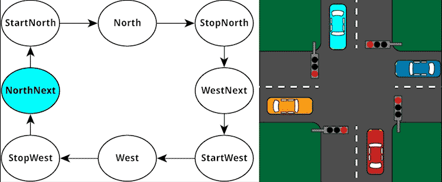

交通信号灯的状态数量有限，我们给它们起了可识别的名称。示例状态机没有控制输入，输出是北/南(north/south)和西/东(west/east)方向的灯的状态。经过的时间和先前的输出状态共同推进该状态机运行。

我们可以使用*枚举类型(enumerated type)*在 VHDL 中表示状态，该数据类型就像`有符号(signed)`或`无符号(unsigned)`类型一样，但我们可以指定可能值的自定义列表而非整数值。事实上，如果你查看[std_logic_1164 package](https://www.csee.umbc.edu/portal/help/VHDL/packages/std_logic_1164.vhd)，你会发现`std_ulogic`类型无非是一个枚举类型，其枚举值是`'U'`、`'X'`、`'0'`、`'1'`、`'Z'`、`'W'`、`'L'`、`'H'`和`'-'`。

一旦有了枚举类型，就可以声明一个新类型的信号，用于跟踪 FSM 的当前状态。

在 VHDL 中用枚举类型声明信号的语法如下所示：

```vhdl
type <type_name> is (<state_name1>, <state_name2>, ...);
signal <signal_name> : <type_name>;
```

使用状态信号(state signal)，然后可以在带有 Case 语句的进程中实现有限状态机。 Case 语句包含针对每种可能状态的 When 语句，程序会针对每种状态选择不同路径。When 语句还可以包含应在该特定状态下执行的代码。当满足预定义条件时，状态通常会发生变化。

单进程状态机(one-process state machine)的模板如下所示：

```vhdl
process(Clk) is
begin
 if rising_edge(Clk) then
  if nRst = '0' then
   State <= <reset_state>;
  else
   case State is
    when <state_name> => 
     <set_outputs_for_this_state_here>          
     if <state_change_condition_is_true> then
      State <= <next_state_name>;
     end if;        
    ...
   end case;
  end if;
 end if;
end process;
```

**Note:
注意：有多种方法可以在 VHDL 中创建 FSM。阅读不同的实现方法：[单进程、双进程、三进程状态机(One-process vs two-process vs three-process state machine)](https://vhdlwhiz.com/n-process-state-machine/)**

## 练习

本视频教程将告诉你如何在VHDL中创建有限状态机：

<https://youtu.be/E-qEnSp1aCk>

在本教程中创建的状态机*测试文件*代码最终如下所示：

```vhdl
library ieee;
use ieee.std_logic_1164.all;
use ieee.numeric_std.all;
 
entity T20_FiniteStateMachineTb is
end entity;
 
architecture sim of T20_FiniteStateMachineTb is
 
    -- We are using a low clock frequency to speed up the simulation
    constant ClockFrequencyHz : integer := 100; -- 100 Hz
    constant ClockPeriod : time := 1000 ms / ClockFrequencyHz;
 
    signal Clk         : std_logic := '1';
    signal nRst        : std_logic := '0';
    signal NorthRed    : std_logic;
    signal NorthYellow : std_logic;
    signal NorthGreen  : std_logic;
    signal WestRed     : std_logic;
    signal WestYellow  : std_logic;
    signal WestGreen   : std_logic;
 
begin
 
    -- The Device Under Test (DUT)
    i_TrafficLights : entity work.T20_TrafficLights(rtl)
    generic map(ClockFrequencyHz => ClockFrequencyHz)
    port map (
        Clk         => Clk,
        nRst        => nRst,
        NorthRed    => NorthRed,
        NorthYellow => NorthYellow,
        NorthGreen  => NorthGreen,
        WestRed     => WestRed,
        WestYellow  => WestYellow,
        WestGreen   => WestGreen);
 
    -- Process for generating clock
    Clk <= not Clk after ClockPeriod / 2;
 
    -- Testbench sequence
    process is
    begin
        wait until rising_edge(Clk);
        wait until rising_edge(Clk);
 
        -- Take the DUT out of reset
        nRst <= '1';
 
        wait;
    end process;
 
end architecture;
```

在本教程中创建的状态机*模块*代码最终如下所示：

```vhdl
library ieee;
use ieee.std_logic_1164.all;
use ieee.numeric_std.all;
 
entity T20_TrafficLights is
generic(ClockFrequencyHz : integer);
port(
    Clk         : in std_logic;
    nRst        : in std_logic; -- Negative reset
    NorthRed    : out std_logic;
    NorthYellow : out std_logic;
    NorthGreen  : out std_logic;
    WestRed     : out std_logic;
    WestYellow  : out std_logic;
    WestGreen   : out std_logic);
end entity;
 
architecture rtl of T20_TrafficLights is
 
    -- Enumerated type declaration and state signal declaration
    type t_State is (NorthNext, StartNorth, North, StopNorth,
                        WestNext, StartWest, West, StopWest);
    signal State : t_State;
 
    -- Counter for counting clock periods, 1 minute max
    signal Counter : integer range 0 to ClockFrequencyHz * 60;
 
begin
 
    process(Clk) is
    begin
        if rising_edge(Clk) then
            if nRst = '0' then
                -- Reset values
                State   <= NorthNext;
                Counter <= 0;
                NorthRed    <= '1';
                NorthYellow <= '0';
                NorthGreen  <= '0';
                WestRed     <= '1';
                WestYellow  <= '0';
                WestGreen   <= '0';
 
            else
                -- Default values
                NorthRed    <= '0';
                NorthYellow <= '0';
                NorthGreen  <= '0';
                WestRed     <= '0';
                WestYellow  <= '0';
                WestGreen   <= '0';
 
                Counter <= Counter + 1;
 
                case State is
 
                    -- Red in all directions
                    when NorthNext =>
                        NorthRed <= '1';
                        WestRed  <= '1';
                        -- If 5 seconds have passed
                        if Counter = ClockFrequencyHz * 5 -1 then
                            Counter <= 0;
                            State   <= StartNorth;
                        end if;
 
                    -- Red and yellow in north/south direction
                    when StartNorth =>
                        NorthRed    <= '1';
                        NorthYellow <= '1';
                        WestRed     <= '1';
                        -- If 5 seconds have passed
                        if Counter = ClockFrequencyHz * 5 -1 then
                            Counter <= 0;
                            State   <= North;
                        end if;
 
                    -- Green in north/south direction
                    when North =>
                        NorthGreen <= '1';
                        WestRed    <= '1';
                        -- If 1 minute has passed
                        if Counter = ClockFrequencyHz * 60 -1 then
                            Counter <= 0;
                            State   <= StopNorth;
                        end if;
 
                    -- Yellow in north/south direction
                    when StopNorth =>
                        NorthYellow <= '1';
                        WestRed     <= '1';
                        -- If 5 seconds have passed
                        if Counter = ClockFrequencyHz * 5 -1 then
                            Counter <= 0;
                            State   <= WestNext;
                        end if;
 
                    -- Red in all directions
                    when WestNext =>
                        NorthRed <= '1';
                        WestRed  <= '1';
                        -- If 5 seconds have passed
                        if Counter = ClockFrequencyHz * 5 -1 then
                            Counter <= 0;
                            State   <= StartWest;
                        end if;
 
                    -- Red and yellow in west/east direction
                    when StartWest =>
                        NorthRed   <= '1';
                        WestRed    <= '1';
                        WestYellow <= '1';
                        -- If 5 seconds have passed
                        if Counter = ClockFrequencyHz * 5 -1 then
                            Counter <= 0;
                            State   <= West;
                        end if;
 
                    -- Green in west/east direction
                    when West =>
                        NorthRed  <= '1';
                        WestGreen <= '1';
                        -- If 1 minute has passed
                        if Counter = ClockFrequencyHz * 60 -1 then
                            Counter <= 0;
                            State   <= StopWest;
                        end if;
 
                    -- Yellow in west/east direction
                    when StopWest =>
                        NorthRed   <= '1';
                        WestYellow <= '1';
                        -- If 5 seconds have passed
                        if Counter = ClockFrequencyHz * 5 -1 then
                            Counter <= 0;
                            State   <= NorthNext;
                        end if;
 
                end case;
 
            end if;
        end if;
    end process;
 
end architecture;
```

在ModelSim控制台输入*run 5 min*命令后的波形视图：


## 解析

我们声明了一个枚举类型，其中包含交通灯的所有八种不同状态。然后，我们声明了所创建新类型的`state`信号。这意味着该信号只能是八个命名状态值之一，而非其他值。

FSM 是在时钟进程中使用 Case 语句实现的。在时钟的每个上升沿，进程唤醒，并评估`state`信号。根据当前状态，运行其中一个`when`选择（分支）中的代码。

在代码中，触发状态变化的是 `Counter`信号的值。当计数器达到预定义值（代表 5 秒或 1 分钟）时，新的状态编码将赋值给`State`信号。然后，当进程在状态值更新后的下一个时钟上升沿唤醒时，FSM 即处于不同的状态。

请注意，我们没有将`'0'`赋值给任何 `when`选择中的任何信号，因为我们在进程开始时已将所有输出信号的默认值设置为`'0'`。你可能还记得之前的教程，最后一个分配给信号的值才有效，信号赋值只有在进程终止后才会生效。如果在进程开始时将`'0'`分配给信号，然后在其中一个when选择中被赋值为`'1'`，信号赋值为`'1'`。

我们可以从波形中看出，`State`信号在八个状态之间循环。稳定的绿色状态持续一分钟，波形图像因此在`北(North)`和`西(West)`状态被切割。

## 要点

- 算法通常作为有限状态机 (finite-state machines,FSMs) 实现
- FSM 可以通过在时钟进程中使用 case 语句来实现
- FSM状态可以用枚举类型实现

# [如何在VHDL中使用函数(HOW TO USE A FUNCTION IN VHDL)](https://vhdlwhiz.com/function/)

函数是 VHDL 中用于实现常用算法的子程序。函数接受零个或多个输入值，并且总是返回一个值。除了返回值之外，函数(function)与过程(procedure)的区别在于函数不能包含Wait语句，这意味着函数总是不消耗模拟时间。

如果你熟悉其他编程语言中的函数(function)或方法(method)，应该能很容易掌握VHDL 函数。在 VHDL 中，我们不能省略返回值或返回空值void，函数必须返回某类型数据，并且必须将返回值赋值给某类型数据。

**本篇博文是[基础VHDL教程(Basic VHDL Tutorials)](https://vhdlwhiz.com/basic-vhdl-tutorials/) 的一部分。**

在 VHDL 中，有两种类型的函数：*pure函数*和*impure函数*。pure函数意味着其不被允许修改或读取任何外部信号。可以肯定的是，当我们用某些参数调用pure函数时，它总是会返回相同的值，我们也称这个函数没有任何*副作用(side effects)*。

在VHDL中声明函数的语法如下所示：

```vhdl
[pure|impure] function <function_name> (<parameter1_name> : <parameter1_type> := <default_value>;
                                        <parameter2_name> : <parameter2_type> := <default_value>;
                                        ... ) return <return_type> is
    <constant_or_variable_declaration>
begin
    <code_performed_by_the_function>
    return <value>
end function;
```

pure/impure关键字是可选的，但如果关键字被省略，它将默认为 pure。所有参数在函数内部都被视为常量，因此它们无法更改。 返回默认值是可选的，并且该函数在 `return`语句处终止。

函数的声明区域在 `is`和 `begin`关键字之间。此处声明的常量、信号或变量仅在本函数内有效，它们不会在后续调用该函数时保留其值。

## 练习

在本教程中，我们将重点关注pure函数，而impure函数将在本系列的后续教程中介绍。

在[上一教程(previous tutorial)](https://vhdlwhiz.com/finite-state-machine/)中，我们使用有限状态机 (FSM) 创建了一个交通灯控制器模块，我们将许多包含计时器计算的代码行从一种状态复制粘贴到另一种状态中，只稍微修改了一个常量。

本视频教程将告诉你如何使用函数来简化状态机代码：

<https://youtu.be/gE8PDBQ8xSA>

在本教程中创建的函数*测试文件*代码最终如下所示

```vhdl
library ieee;
use ieee.std_logic_1164.all;
use ieee.numeric_std.all;
 
entity T21_FunctionTb is
end entity;
 
architecture sim of T21_FunctionTb is
 
    -- We are using a low clock frequency to speed up the simulation
    constant ClockFrequencyHz : integer := 100; -- 100 Hz
    constant ClockPeriod : time := 1000 ms / ClockFrequencyHz;
 
    signal Clk         : std_logic := '1';
    signal nRst        : std_logic := '0';
    signal NorthRed    : std_logic;
    signal NorthYellow : std_logic;
    signal NorthGreen  : std_logic;
    signal WestRed     : std_logic;
    signal WestYellow  : std_logic;
    signal WestGreen   : std_logic;
 
begin
 
    -- The Device Under Test (DUT)
    i_TrafficLights : entity work.T21_TrafficLights(rtl)
    generic map(ClockFrequencyHz => ClockFrequencyHz)
    port map (
        Clk         => Clk,
        nRst        => nRst,
        NorthRed    => NorthRed,
        NorthYellow => NorthYellow,
        NorthGreen  => NorthGreen,
        WestRed     => WestRed,
        WestYellow  => WestYellow,
        WestGreen   => WestGreen);
 
    -- Process for generating clock
    Clk <= not Clk after ClockPeriod / 2;
 
    -- Testbench sequence
    process is
    begin
        wait until rising_edge(Clk);
        wait until rising_edge(Clk);
 
        -- Take the DUT out of reset
        nRst <= '1';
 
        wait;
    end process;
 
end architecture;
```

交通信号灯*模块*的最终代码如下所示：

```vhdl
library ieee;
use ieee.std_logic_1164.all;
use ieee.numeric_std.all;
 
entity T21_TrafficLights is
generic(ClockFrequencyHz : natural);
port(
    Clk         : in std_logic;
    nRst        : in std_logic; -- Negative reset
    NorthRed    : out std_logic;
    NorthYellow : out std_logic;
    NorthGreen  : out std_logic;
    WestRed     : out std_logic;
    WestYellow  : out std_logic;
    WestGreen   : out std_logic);
end entity;
 
architecture rtl of T21_TrafficLights is
 
    -- Enumerated type declaration and state signal declaration
    type t_State is (NorthNext, StartNorth, North, StopNorth,
                        WestNext, StartWest, West, StopWest);
    signal State : t_State;
 
    -- Calculate the number of clock cycles in minutes/seconds
    function CounterVal(Minutes : integer := 0;
                        Seconds : integer := 0) return integer is
        variable TotalSeconds : integer;
    begin
        TotalSeconds := Seconds + Minutes * 60;
        return TotalSeconds * ClockFrequencyHz -1;
    end function;
 
    -- Counter for counting clock periods, 1 minute max
    signal Counter : integer range 0 to CounterVal(Minutes => 1) +1;
 
begin
 
    process(Clk) is
    begin
 
        if rising_edge(Clk) then
            if nRst = '0' then
                -- Reset values
                NorthRed    <= '1';
                NorthYellow <= '0';
                NorthGreen  <= '0';
                WestRed     <= '1';
                WestYellow  <= '0';
                WestGreen   <= '0';
                State       <= NorthNext;
                Counter     <= 0;
 
            else
                -- Default values
                NorthRed    <= '0';
                NorthYellow <= '0';
                NorthGreen  <= '0';
                WestRed     <= '0';
                WestYellow  <= '0';
                WestGreen   <= '0';
 
                Counter <= Counter + 1;
 
                case State is
 
                    -- Red light in all directions
                    when NorthNext =>
                        NorthRed <= '1';
                        WestRed  <= '1';
                        -- If 5 seconds have passed
                        if Counter = CounterVal(Seconds => 5) then
                            Counter <= 0;
                            State   <= StartNorth;
                        end if;
 
                    -- Yellow light in north/south directions
                    when StartNorth =>
                        NorthRed    <= '1';
                        NorthYellow <= '1';
                        WestRed     <= '1';
                        -- If 5 seconds have passed
                        if Counter = CounterVal(Seconds => 5) then
                            Counter <= 0;
                            State   <= North;
                        end if;
 
                    -- Green light in north/south directions
                    when North =>
                        NorthGreen <= '1';
                        WestRed    <= '1';
                        -- If 1 minute has passed
                        if Counter = CounterVal(Minutes => 1) then
                            Counter <= 0;
                            State   <= StopNorth;
                        end if;
 
                    -- Red and yellow light in north/south direction
                    when StopNorth =>
                        NorthYellow <= '1';
                        WestRed     <= '1';
                        -- If 5 seconds have passed
                        if Counter = CounterVal(Seconds => 5) then
                            Counter <= 0;
                            State   <= WestNext;
                        end if;
 
                    -- Red light in all directions
                    when WestNext =>
                        NorthRed <= '1';
                        WestRed  <= '1';
                        -- If 5 seconds have passedf
                        if Counter = CounterVal(Seconds => 5) then
                            Counter <= 0;
                            State   <= StartWest;
                        end if;
 
                    -- Yellow light in west/east direction
                    when StartWest =>
                        NorthRed   <= '1';
                        WestRed    <= '1';
                        WestYellow <= '1';
                        -- If 5 seconds have passed
                        if Counter = CounterVal(Seconds => 5) then
                            Counter <= 0;
                            State   <= West;
                        end if;
 
                    -- Green light in west/east direction
                    when West =>
                        NorthRed  <= '1';
                        WestGreen <= '1';
                        -- If 1 minute has passed
                        if Counter = CounterVal(Minutes => 1) then
                            Counter <= 0;
                            State   <= StopWest;
                        end if;
 
                    -- Red and yellow light in west/east direction
                    when StopWest =>
                        NorthRed   <= '1';
                        WestYellow <= '1';
                        -- If 5 seconds have passed
                        if Counter = CounterVal(Seconds => 5) then
                            Counter <= 0;
                            State   <= NorthNext;
                        end if;
 
                end case;
            end if;
        end if;
 
    end process;
 
end architecture;
```

在ModelSim控制台输入`run 5 min`命令后的波形视图：


在进出 `StartNorth`状态的转换中添加光标的波形视图：
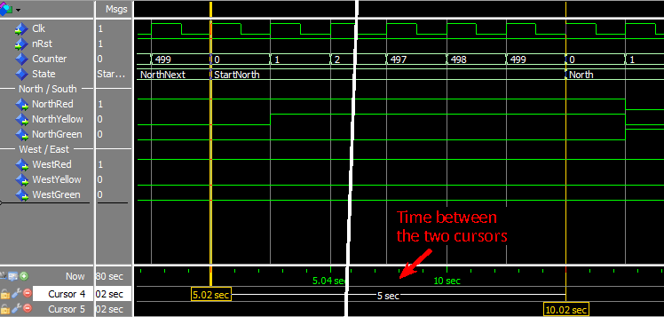

## 解析

我们调用新创建的 `CounterVal`函数`if Counter = CounterVal(Seconds => 5) then`替换了之前教程中的计时器计算`if Counter = ClockFrequencyHz * 5 -1 then`。

从第一个波形截图可以看出，模块功能并没有变化。在设计实践中，建议将函数用于重复性任务，特别当你可以用包含诸如`Minutes`和`Seconds`之类术语的、更具可读性的代码行替换。

使用函数的另一个好处是可以一次更改所有计时器的实现，而不是逐行更改。例如，在 `CounterVal`函数中的`return TotalSeconds * ClockFrequencyHz;`，所有计时器都将持续一个太长的时钟周期。然后我们可以在`CounterVal`函数中将其更改为 `return TotalSeconds * ClockFrequencyHz -1`;，所有计时器将立即修复。

如果我们检查最后一个波形视图截图，我们就会明白为什么我们需要从 `CounterVal`函数返回的计时器值中减去 1。此波形检查 `StartNorth`状态的持续时间，它应该持续整整五秒钟。当`State`信号变为`StartNorth`时，`Counter`值为0，且只在下一个时钟周期后才发生变化。所以，如果我们计算了 500 个时钟周期，`StartNorth`状态实际上会持续 501 个周期。我们的测试文件(testbench)以 100 Hz 的频率运行，500 个时钟周期正好是 5 秒。

## 要点

- 函数可以接受零个或多个参数，但只能返回一个值
- 函数不能包含`wait`语句
- pure函数不能有副作用(side effects)，而impure函数可以

# [如何在VHDL中使用impure函数(HOW TO USE AN IMPURE FUNCTION IN VHDL )](https://vhdlwhiz.com/impure-function/)

impure函数可以读取或写入其范围内的任何信号，也可以读取或写入不在参数列表中的信号，即称函数有*副作用(side effects)*。

我们所说的副作用是指不能保证函数每次使用相同的参数调用时都会返回相同的值。 如果函数可以读取不在参数列表中的信号，则返回值也可能取决于这些影子参数(shadow parameters)。此外，该函数可能改变未经其返回值赋值的外部信号。

**本篇博文是[基础VHDL教程(Basic VHDL Tutorials)](https://vhdlwhiz.com/basic-vhdl-tutorials/) 的一部分。**

尽管我们可以在任何允许声明pure函数的地方声明impure函数，但只有在进程中使用impure函数才有意义。当在通常声明信号的架构中声明函数时，编译时没有任何信号会在其范围内。因此，当在架构(architecture)或包(package)中声明时，impure函数并不能实现比pure函数更多的功能。

使用impure函数的动机主要是为了整理代码。我们可以简单地通过将其添加到pure函数参数列表来操作任何信号，但如果参数列表变得太长，它会混淆而不是简化代码。

声明impure函数的语法只要在声明时编写`impure function`而不是`function`。有关通用函数的语法，请参阅[函数教程(function tutorial)](https://vhdlwhiz.com/function/)。

## 练习

在[上一教程(previous tutorial)](https://vhdlwhiz.com/function/)中，我们通过使用计算时间延迟值的函数简化了有限状态机 (FSM) 代码。我们提供了 Minutes 和 Seconds 参数来指定希望将每个状态更改延迟 的具体时间。

如果 `CounterVal`函数返回`true`，则时间已过，是时候进入下一个 FSM 状态了。在同一进程中，我们还必须重置`Counter`信号，否则该功能将无法在下一个状态下运行，计时器已经失效了。

当函数返回真时，`Counter`信号将设置为 `0`。如果这发生在 `CounterVal`函数中而不是状态机代码中的多处岂不是更好吗？

在本视频教程中，我们将使用impure函数改进上一教程中的 FSM 代码：

<https://youtu.be/BWl8RNXLbkM>

在本教程中创建的impure函数的*测试文件*代码最终如下所示

```vhdl
library ieee;
use ieee.std_logic_1164.all;
use ieee.numeric_std.all;
 
entity T22_ImpureFunctionTb is
end entity;
 
architecture sim of T22_ImpureFunctionTb is
 
    -- We are using a low clock frequency to speed up the simulation
    constant ClockFrequencyHz : integer := 100; -- 100 Hz
    constant ClockPeriod : time := 1000 ms / ClockFrequencyHz;
 
    signal Clk         : std_logic := '1';
    signal nRst        : std_logic := '0';
    signal NorthRed    : std_logic;
    signal NorthYellow : std_logic;
    signal NorthGreen  : std_logic;
    signal WestRed     : std_logic;
    signal WestYellow  : std_logic;
    signal WestGreen   : std_logic;
 
begin
 
    -- The Device Under Test (DUT)
    i_TrafficLights : entity work.T22_TrafficLights(rtl)
    generic map(ClockFrequencyHz => ClockFrequencyHz)
    port map (
        Clk         => Clk,
        nRst        => nRst,
        NorthRed    => NorthRed,
        NorthYellow => NorthYellow,
        NorthGreen  => NorthGreen,
        WestRed     => WestRed,
        WestYellow  => WestYellow,
        WestGreen   => WestGreen);
 
    -- Process for generating clock
    Clk <= not Clk after ClockPeriod / 2;
 
    -- Testbench sequence
    process is
    begin
        wait until rising_edge(Clk);
        wait until rising_edge(Clk);
 
        -- Take the DUT out of reset
        nRst <= '1';
 
        wait;
    end process;
 
end architecture;
```

在本教程中创建的交通信号灯*模块*的代码最终如下所示

```vhdl
library ieee;
use ieee.std_logic_1164.all;
use ieee.numeric_std.all;
 
entity T22_TrafficLights is
generic(ClockFrequencyHz : integer);
port(
    Clk         : in std_logic;
    nRst        : in std_logic; -- Negative reset
    NorthRed    : out std_logic;
    NorthYellow : out std_logic;
    NorthGreen  : out std_logic;
    WestRed     : out std_logic;
    WestYellow  : out std_logic;
    WestGreen   : out std_logic);
end entity;
 
architecture rtl of T22_TrafficLights is
 
    -- Calculate the number of clock cycles in minutes/seconds
    function CounterVal(Minutes : integer := 0;
                        Seconds : integer := 0) return integer is
        variable TotalSeconds : integer;
    begin
        TotalSeconds := Seconds + Minutes * 60;
        return TotalSeconds * ClockFrequencyHz -1;
    end function;
 
    -- Enumerated type declaration and state signal declaration
    type t_State is (NorthNext, StartNorth, North, StopNorth,
                        WestNext, StartWest, West, StopWest);
    signal State : t_State;
 
    -- Counter for counting clock periods, 1 minute max
    signal Counter : integer range 0 to ClockFrequencyHz * 60;
 
begin
 
    process(Clk) is
 
        -- This impure function reads and drives the Counter signal
        -- which is not on the parameter list.
        impure function CounterExpired(Minutes : integer := 0;
                                       Seconds : integer := 0)
                                       return boolean is
        begin
            if Counter = CounterVal(Minutes, Seconds) then
                Counter <= 0;
                return true;
            else
                return false;
            end if;
        end function;
 
    begin
        if rising_edge(Clk) then
            if nRst = '0' then
                -- Reset values
                State   <= NorthNext;
                Counter <= 0;
                NorthRed    <= '1';
                NorthYellow <= '0';
                NorthGreen  <= '0';
                WestRed     <= '1';
                WestYellow  <= '0';
                WestGreen   <= '0';
 
            else
                -- Default values
                NorthRed    <= '0';
                NorthYellow <= '0';
                NorthGreen  <= '0';
                WestRed     <= '0';
                WestYellow  <= '0';
                WestGreen   <= '0';
 
                Counter <= Counter + 1;
 
                case State is
 
                    -- Red in all directions
                    when NorthNext =>
                        NorthRed <= '1';
                        WestRed  <= '1';
                        -- If 5 seconds have passed
                        if CounterExpired(Seconds => 5) then
                            State <= StartNorth;
                        end if;
 
                    -- Red and yellow in north/south direction
                    when StartNorth =>
                        NorthRed    <= '1';
                        NorthYellow <= '1';
                        WestRed     <= '1';
                        -- If 5 seconds have passed
                        if CounterExpired(Seconds => 5) then
                            State <= North;
                        end if;
 
                    -- Green in north/south direction
                    when North =>
                        NorthGreen <= '1';
                        WestRed    <= '1';
                        -- If 1 minute has passed
                        if CounterExpired(Minutes => 1) then
                            State <= StopNorth;
                        end if;
 
                    -- Yellow in north/south direction
                    when StopNorth =>
                        NorthYellow <= '1';
                        WestRed     <= '1';
                        -- If 5 seconds have passed
                        if CounterExpired(Seconds => 5) then
                            State <= WestNext;
                        end if;
 
                    -- Red in all directions
                    when WestNext =>
                        NorthRed <= '1';
                        WestRed  <= '1';
                        -- If 5 seconds have passed
                        if CounterExpired(Seconds => 5) then
                            State <= StartWest;
                        end if;
 
                    -- Red and yellow in west/east direction
                    when StartWest =>
                        NorthRed   <= '1';
                        WestRed    <= '1';
                        WestYellow <= '1';
                        -- If 5 seconds have passed
                        if CounterExpired(Seconds => 5) then
                            State <= West;
                        end if;
 
                    -- Green in west/east direction
                    when West =>
                        NorthRed  <= '1';
                        WestGreen <= '1';
                        -- If 1 minute has passed
                        if CounterExpired(Minutes => 1) then
                            State <= StopWest;
                        end if;
 
                    -- Yellow in west/east direction
                    when StopWest =>
                        NorthRed   <= '1';
                        WestYellow <= '1';
                        -- If 5 seconds have passed
                        if CounterExpired(Seconds => 5) then
                            State <= NorthNext;
                        end if;
 
                end case;
 
            end if;
        end if;
    end process;
 
end architecture;
```

在ModelSim控制台输入*run 5 min*命令后的波形视图：


## 解析

从波形视图可以看出，添加impure函数后，模块输出保持不变，因为逻辑并没有改变，只是代码改变了。

`Counter`信号的评估已从 FSM 代码移至新的impure函数 `CounterExpired`。用于清除`Counter`信号的`Counter <= 0;`  也已移至impure函数中。

结果得到的是一个更易读的、更容易维护的FSM 代码。尽管比较主观，但对我来说，`CounterExpired(Seconds => 5)`比`Counter = CounterVal(Seconds => 5)`更容易阅读。

多大程度地使用impure函数完全取决于你和为你的服务付费的人。有些人认为应该谨慎使用它们，因为很难看清隐藏在子程序中算法的所有因果关系。包括我在内的其他人觉得只要意图明确，越容易阅读的代码实际上越不容易出错。

因此，与用于实践生产的模块相比，你更有可能在测试文件的代码中发现impure函数。测试文件通常比它们正在测试的模块更复杂，并且对代码正确性的要求不如对 RTL 代码严格。

## 要点

- impure函数可以读取或驱动不在其参数列表中的信号
- 只有在进程中声明impure函数才有意义

# [如何在VHDL的进程中使用过程(HOW TO USE A PROCEDURE IN A PROCESS IN VHDL )](https://vhdlwhiz.com/procedure-in-process/)

从过程中驱动外部信号：只要信号在过程范围内，就可以访问信号进行读取或写入，即使它没有列在参数列表中。

在架构的声明区域中声明的过程不能驱动任何外部信号，是因为在编译时它的范围内没有信号；另一方面，在进程内声明的过程将有权访问该进程可见的所有信号。

**本篇博文是[基础VHDL教程(Basic VHDL Tutorials)](https://vhdlwhiz.com/basic-vhdl-tutorials/) 的一部分。**

此类过程可用于在多次出现相同操作的进程中整理算法。我们可以使用一个正常的过程，在调用它时所有输入和输出都赋值给本地信号。但以上不是重点，更重要的是通过省略过程调用的输入和输出信号，我们必须减少输入，使代码更具可读性。

想象一个实现复杂通信协议的进程。如果将某些操作替换为 `RequestToSend()`或 `SendAutorizationHeader()`等过程调用，将更容易理解主要算法的执行流程。只需查看过程名称，即可知道代码的作用。

## 练习

在[上一教程(previous tutorial)](https://vhdlwhiz.com/impure-function/)中，impure函数简化了有限状态机 (FSM) 代码。我们用impure函数驱动`Counter`信号，并使用返回值来确定何时更改状态。但是，如果我们想将`State`信号的赋值也移到函数中，而忽略返回值应该怎么办呢？

如果不将返回值赋值给 VHDL 中的某数据类型，就不可能调用函数。如果我们执意这样做，ModelSim 将产生编译错误：No feasible entries for subprogram “CounterExpired”。

但是，我们可以使用过程。在进程内声明的过程可以访问该进程范围内的任何信号，这类似于impure函数，但由于它是一个过程，因此没有返回值。

在本视频教程中，我们将在进程中声明的过程来简化 FSM 代码：

<https://youtu.be/5wnBlWSPF20>

在本教程中创建的进程中使用过程的*测试文件*代码最终如下所示：

```vhdl
library ieee;
use ieee.std_logic_1164.all;
use ieee.numeric_std.all;
 
entity T23_ProcedureInProcessTb is
end entity;
 
architecture sim of T23_ProcedureInProcessTb is
 
    -- We are using a low clock frequency to speed up the simulation
    constant ClockFrequencyHz : integer := 100; -- 100 Hz
    constant ClockPeriod : time := 1000 ms / ClockFrequencyHz;
     
    signal Clk         : std_logic := '1';
    signal nRst        : std_logic := '0';
    signal NorthRed    : std_logic;
    signal NorthYellow : std_logic;
    signal NorthGreen  : std_logic;
    signal WestRed     : std_logic;
    signal WestYellow  : std_logic;
    signal WestGreen   : std_logic;
 
begin
 
    -- The Device Under Test (DUT)
    i_TrafficLights : entity work.T23_TrafficLights(rtl)
    generic map(ClockFrequencyHz => ClockFrequencyHz)
    port map (
        Clk         => Clk,
        nRst        => nRst,
        NorthRed    => NorthRed,
        NorthYellow => NorthYellow,
        NorthGreen  => NorthGreen,
        WestRed     => WestRed,
        WestYellow  => WestYellow,
        WestGreen   => WestGreen);
 
 
    -- Process for generating clock
    Clk <= not Clk after ClockPeriod / 2;
 
    -- Testbench sequence
    process is
    begin
        wait until rising_edge(Clk);
        wait until rising_edge(Clk);
     
        -- Take the DUT out of reset
        nRst <= '1';
     
        wait;
    end process;
     
end architecture;
```

在本教程中创建的交通信号灯*模块*的代码最终如下所示

```vhdl
library ieee;
use ieee.std_logic_1164.all;
use ieee.numeric_std.all;
 
entity T23_TrafficLights is
generic(ClockFrequencyHz : integer);
port(
    Clk         : in std_logic;
    nRst        : in std_logic; -- Negative reset
    NorthRed    : out std_logic;
    NorthYellow : out std_logic;
    NorthGreen  : out std_logic;
    WestRed     : out std_logic;
    WestYellow  : out std_logic;
    WestGreen   : out std_logic);
end entity;
 
architecture rtl of T23_TrafficLights is
 
    -- Enumerated type declaration and state signal declaration
    type t_State is (NorthNext, StartNorth, North, StopNorth,
                        WestNext, StartWest, West, StopWest);
    signal State : t_State;
 
    -- Counter for counting clock periods, 1 minute max
    signal Counter : integer range 0 to ClockFrequencyHz * 60;
 
begin
 
    process(Clk) is
 
        -- Procedure for changing state after a given time
        procedure ChangeState(ToState : t_State;
                              Minutes : integer := 0;
                              Seconds : integer := 0) is
            variable TotalSeconds : integer;
            variable ClockCycles  : integer;
        begin
            TotalSeconds := Seconds + Minutes * 60;
            ClockCycles  := TotalSeconds * ClockFrequencyHz -1;
            if Counter = ClockCycles then
                Counter <= 0;
                State   <= ToState;
            end if;
        end procedure;
 
    begin
        if rising_edge(Clk) then
            if nRst = '0' then
                -- Reset values
                State   <= NorthNext;
                Counter <= 0;
                NorthRed    <= '1';
                NorthYellow <= '0';
                NorthGreen  <= '0';
                WestRed     <= '1';
                WestYellow  <= '0';
                WestGreen   <= '0';
 
            else
                -- Default values
                NorthRed    <= '0';
                NorthYellow <= '0';
                NorthGreen  <= '0';
                WestRed     <= '0';
                WestYellow  <= '0';
                WestGreen   <= '0';
 
                Counter <= Counter + 1;
 
                case State is
 
                    -- Red in all directions
                    when NorthNext =>
                        NorthRed <= '1';
                        WestRed  <= '1';
                        ChangeState(StartNorth, Seconds => 5);
 
                    -- Red and yellow in north/south direction
                    when StartNorth =>
                        NorthRed    <= '1';
                        NorthYellow <= '1';
                        WestRed     <= '1';
                        ChangeState(North, Seconds => 5);
 
                    -- Green in north/south direction
                    when North =>
                        NorthGreen <= '1';
                        WestRed    <= '1';
                        ChangeState(StopNorth, Minutes => 1);
 
                    -- Yellow in north/south direction
                    when StopNorth =>
                        NorthYellow <= '1';
                        WestRed     <= '1';
                        ChangeState(WestNext, Seconds => 5);
 
                    -- Red in all directions
                    when WestNext =>
                        NorthRed <= '1';
                        WestRed  <= '1';
                        ChangeState(StartWest, Seconds => 5);
 
                    -- Red and yellow in west/east direction
                    when StartWest =>
                        NorthRed   <= '1';
                        WestRed    <= '1';
                        WestYellow <= '1';
                        ChangeState(West, Seconds => 5);
 
                    -- Green in west/east direction
                    when West =>
                        NorthRed  <= '1';
                        WestGreen <= '1';
                        ChangeState(StopWest, Minutes => 1);
 
                    -- Yellow in west/east direction
                    when StopWest =>
                        NorthRed   <= '1';
                        WestYellow <= '1';
                        ChangeState(NorthNext, Seconds => 5);
 
                end case;
 
            end if;
        end if;
    end process;
 
end architecture;
```

在ModelSim控制台输入`run 5 min`命令后的波形视图：

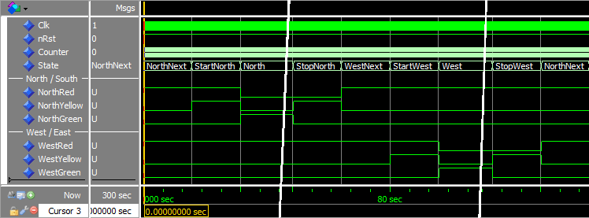

## 要点

- 在进程中声明的过程可以访问该进程范围内的任何信号
- 进程中的过程可用于提高代码的可读性
